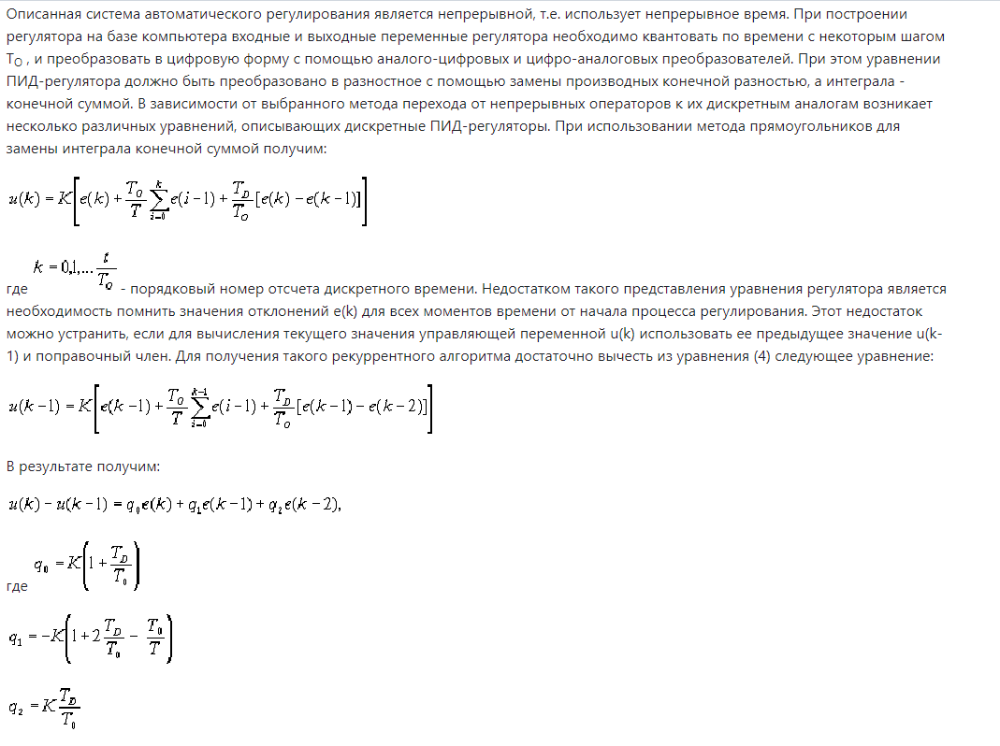
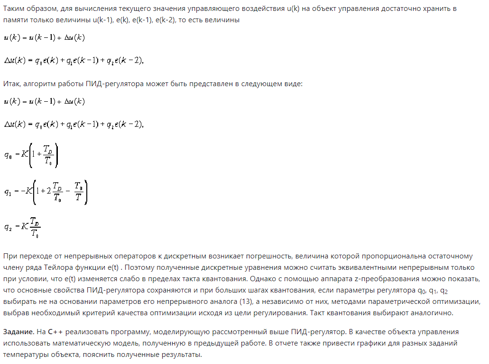

<p align="center"> Министерство образования Республики Беларусь</p>
<p align="center">Учреждение образования</p>
<p align="center">“Брестский Государственный технический университет”</p>
<p align="center">Кафедра ИИТ</p>
<br><br><br><br><br><br><br>
<p align="center">Лабораторная работа №2</p>
<p align="center">По дисциплине “Общая теория интеллектуальных систем”</p>
<p align="center">Тема: “ПИД-регуляторы”</p>
<br><br><br><br><br>
<p align="right">Выполнил:</p>
<p align="right">Студент 2 курса</p>
<p align="right">Группы ИИ-24</p>
<p align="right">Баранчук И. Я.</p>
<p align="right">Проверил:</p>
<p align="right">Иванюк Д. С.</p>
<br><br><br><br><br>
<p align="center">Брест 2023</p>

---

# Общее задание #
1. Написать отчет по выполненной лабораторной работе №2 в .md формате (readme.md) и с помощью запроса на внесение изменений (**pull request**) разместить его в следующем каталоге: **trunk\ii0xxyy\task_01\doc** (где **xx** - номер группы, **yy** - номер студента, например **ii02102**).
2. Исходный код написанной программы разместить в каталоге: **trunk\ii02402\task_02\src**.

{: width="800px" height="900px"}
{: width="800px" height="700px"}
{: width="800px" height="00px"}
{: width="800px" height="900px"}

```c++
#include <iostream>
#include <vector>
using namespace std;

const double PropComp = 0.097;    // Proportional component
const double IntComp = 2.1623;    // Integral component
const double DiffComp = 1.0;      // Differential component
const double timeInterval = 1.0;  // Interval

const double q1 = PropComp * (1 + DiffComp / timeInterval);
const double q2 = -PropComp * (1 + 2 * DiffComp / timeInterval - timeInterval / IntComp);
const double q3 = (PropComp * DiffComp) / timeInterval;

double calculate_linear_model(double y_current, double alpha, double beta, double controlInput) {
    y_current = alpha * y_current + beta * controlInput;
    return y_current;
}

const int totalIterations = 100;      // Number of iterations
const double desiredValue = 29.0;  // Desired value

void executeMainFunction() {
    cout << "EXECUTION BEGINS" << endl;
    vector<double> y_values;
    vector<double> controlInputs;
    double alpha = 0.8;
    double beta = 0.3;
    double y = 0.0;
    double previousControlInput = 0.0;
    double controlInput = 0.0;
    double deltaControlInput = 0.0;
    vector<double> errorVector = { 0.0, 0.0, 0.0 };

    for (int i = 1; i <= totalIterations; i++) {
        errorVector[2] = errorVector[1];
        errorVector[1] = abs(desiredValue - y);
        deltaControlInput = q1 * errorVector[1] + q2 * errorVector[2] + q3 * errorVector[0];
        previousControlInput = controlInput;
        controlInput = previousControlInput + deltaControlInput;
        y = calculate_linear_model(y, alpha, beta, controlInput);
        y_values.push_back(y);
        controlInputs.push_back(controlInput);
        cout << i << ". y = " << y << "\t| controlInput = " << controlInput << endl;
    }
}

int main() {
    executeMainFunction();
    return 0;
}

```
# console:
EXECUTION BEGINS
1. y = 1.6878   | controlInput = 5.626
2. y = 2.48619  | controlInput = 3.7865
3. y = 2.65121  | controlInput = 2.20754
4. y = 2.3589   | controlInput = 0.793087
5. y = 1.72991  | controlInput = -0.524039
6. y = 0.846597 | controlInput = -1.79109
7. y = -0.235203        | controlInput = -3.0416
8. y = -1.47806 | controlInput = -4.29966
9. y = -2.85731 | controlInput = -5.58288
10. y = -4.35718        | controlInput = -6.90444
11. y = -5.9681 | controlInput = -8.27452
12. y = -7.68486        | controlInput = -9.70126
13. y = -9.50532        | controlInput = -11.1915
14. y = -11.4296        | controlInput = -12.751
15. y = -13.4593        | controlInput = -14.3854
16. y = -15.5973        | controlInput = -16.0997
17. y = -17.8475        | controlInput = -17.8987
18. y = -20.2142        | controlInput = -19.7875
19. y = -22.7027        | controlInput = -21.771
20. y = -25.3185        | controlInput = -23.8543
21. y = -28.0676        | controlInput = -26.0426
22. y = -30.9565        | controlInput = -28.3415
23. y = -33.9922        | controlInput = -30.7566
24. y = -37.1819        | controlInput = -33.2938
25. y = -40.5333        | controlInput = -35.9594
26. y = -44.0547        | controlInput = -38.76
27. y = -47.7544        | controlInput = -41.7024
28. y = -51.6417        | controlInput = -44.7937
29. y = -55.7258        | controlInput = -48.0416
30. y = -60.0168        | controlInput = -51.4539
31. y = -64.5252        | controlInput = -55.0391
32. y = -69.2619        | controlInput = -58.8059
33. y = -74.2385        | controlInput = -62.7634
34. y = -79.4672        | controlInput = -66.9213
35. y = -84.9607        | controlInput = -71.2899
36. y = -90.7325        | controlInput = -75.8796
37. y = -96.7965        | controlInput = -80.7019
38. y = -103.168        | controlInput = -85.7683
39. y = -109.862        | controlInput = -91.0914
40. y = -116.895        | controlInput = -96.6841
41. y = -124.284        | controlInput = -102.56
42. y = -132.047        | controlInput = -108.733
43. y = -140.203        | controlInput = -115.22
44. y = -148.773        | controlInput = -122.034
45. y = -157.777        | controlInput = -129.194
46. y = -167.236        | controlInput = -136.717
47. y = -177.175        | controlInput = -144.62
48. y = -187.617        | controlInput = -152.924
49. y = -198.588        | controlInput = -161.648
50. y = -210.115        | controlInput = -170.814
51. y = -222.225        | controlInput = -180.445
52. y = -234.949        | controlInput = -190.563
53. y = -248.317        | controlInput = -201.193
54. y = -262.362        | controlInput = -212.362
55. y = -277.119        | controlInput = -224.097
56. y = -292.623        | controlInput = -236.426
57. y = -308.912        | controlInput = -249.379
58. y = -326.026        | controlInput = -262.989
59. y = -344.007        | controlInput = -277.287
60. y = -362.899        | controlInput = -292.31
61. y = -382.747        | controlInput = -308.094
62. y = -403.601        | controlInput = -324.677
63. y = -425.511        | controlInput = -342.1
64. y = -448.53 | controlInput = -360.406
65. y = -472.716        | controlInput = -379.638
66. y = -498.126        | controlInput = -399.845
67. y = -524.823        | controlInput = -421.075
68. y = -552.873        | controlInput = -443.38
69. y = -582.343        | controlInput = -466.815
70. y = -613.305        | controlInput = -491.437
71. y = -645.836        | controlInput = -517.306
72. y = -680.014        | controlInput = -544.485
73. y = -715.923        | controlInput = -573.04
74. y = -753.651        | controlInput = -603.042
75. y = -793.29 | controlInput = -634.564
76. y = -834.937        | controlInput = -667.681
77. y = -878.692        | controlInput = -702.477
78. y = -924.664        | controlInput = -739.034
79. y = -972.964        | controlInput = -777.443
80. y = -1023.71        | controlInput = -817.797
81. y = -1077.03        | controlInput = -860.195
82. y = -1133.04        | controlInput = -904.74
83. y = -1191.9 | controlInput = -951.542
84. y = -1253.73        | controlInput = -1000.71
85. y = -1318.7 | controlInput = -1052.38
86. y = -1386.95        | controlInput = -1106.65
87. y = -1458.67        | controlInput = -1163.68
88. y = -1534.01        | controlInput = -1223.6
89. y = -1613.18        | controlInput = -1286.55
90. y = -1696.35        | controlInput = -1352.69
91. y = -1783.73        | controlInput = -1422.18
92. y = -1875.54        | controlInput = -1495.18
93. y = -1972   | controlInput = -1571.89
94. y = -2073.34        | controlInput = -1652.48
95. y = -2179.82        | controlInput = -1737.15
96. y = -2291.69        | controlInput = -1826.11
97. y = -2409.22        | controlInput = -1919.58
98. y = -2532.71        | controlInput = -2017.78
99. y = -2662.45        | controlInput = -2120.95
100. y = -2798.77       | controlInput = -2229.35
