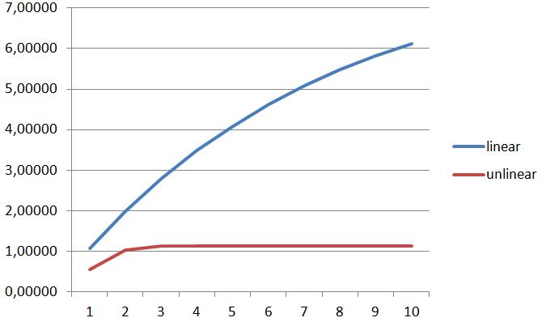

<p align="center"> Министерство образования Республики Беларусь</p>
<p align="center">Учреждение образования</p>
<p align="center">“Брестский Государственный технический университет”</p>
<p align="center">Кафедра ИИТ</p>
<br><br><br><br><br><br><br>
<p align="center">Лабораторная работа №1</p>
<p align="center">По дисциплине “Общая теория интеллектуальных систем”</p>
<p align="center">Тема: “Моделирования температуры объекта”</p>
<br><br><br><br><br>
<p align="right">Выполнил:</p>
<p align="right">Студент 2 курса</p>
<p align="right">Группы ИИ-24</p>
<p align="right">Бузель С. Д.</p>
<p align="right">Проверил:</p>
<p align="right">Иванюк Д. С.</p>
<br><br><br><br><br>
<p align="center">Брест 2023</p>

---

# Общее задание #
1. Написать отчет по выполненной лабораторной работе №1 в .md формате (readme.md) и с помощью запроса на внесение изменений (**pull request**) разместить его в следующем каталоге: **trunk\ii0xxyy\task_01\doc** (где **xx** - номер группы, **yy** - номер студента, например **ii02102**).
2. Исходный код написанной программы разместить в каталоге: **trunk\ii0xxyy\task_01\src**.

## Task 1. Modeling controlled object ##
Let's get some object to be controlled. We want to control its temperature, which can be described by this differential equation:

$$\Large\frac{dy(\tau)}{d\tau}=\frac{u(\tau)}{C}+\frac{Y_0-y(\tau)}{RC} $$ (1)

where $\tau$ – time; $y(\tau)$ – input temperature; $u(\tau)$ – input warm; $Y_0$ – room temperature; $C,RC$ – some constants.

After transformation we get these linear (2) and nonlinear (3) models:

$$\Large y_{\tau+1}=ay_{\tau}+bu_{\tau}$$ (2)
$$\Large y_{\tau+1}=ay_{\tau}-by_{\tau-1}^2+cu_{\tau}+d\sin(u_{\tau-1})$$ (3)

where $\tau$ – time discrete moments ($1,2,3{\dots}n$); $a,b,c,d$ – some constants.

Task is to write program (**С++**), which simulates this object temperature.

---

# Выполнение задания #

Код программы:
```C++
#include <iostream>
#include <cmath>

class TemperatureSimulator {
private:
    double a_linear, b_linear;
    double a_nonlinear, b_nonlinear, c_nonlinear, d_nonlinear;
    double y_linear, y_nonlinear, y_prev_nonlinear;

public:
    TemperatureSimulator(double a_linear_val, double b_linear_val, double a_nonlinear_val, double b_nonlinear_val, double c_nonlinear_val, double d_nonlinear_val)    //присвоить значение
        : a_linear(a_linear_val), b_linear(b_linear_val), a_nonlinear(a_nonlinear_val), b_nonlinear(b_nonlinear_val), c_nonlinear(c_nonlinear_val), d_nonlinear(d_nonlinear_val),
        y_linear(0), y_nonlinear(0), y_prev_nonlinear(0) {}


    void simulateLinearModel(double u) {
        y_linear = a_linear * y_linear + b_linear * u;
    }

    void simulateNonlinearModel(double u, double u_prev) {
        y_nonlinear = a_nonlinear * y_nonlinear - b_nonlinear * pow(y_prev_nonlinear, 2) + c_nonlinear * u + d_nonlinear * sin(u_prev);
        y_prev_nonlinear = y_nonlinear;
    }

    double getCurrentTemperatureLinear() {
        return y_linear;
    }

    double getCurrentTemperatureNonlinear() {
        return y_nonlinear;
    }
};

int main() {

    double a_linear = 0.87;
    double b_linear = 0.53;
    double a_nonlinear = 0.77;
    double b_nonlinear = 0.35;
    double c_nonlinear = 0.28;
    double d_nonlinear = 0.17;
    double u = 2;
    double u_prev = 0;

    TemperatureSimulator simulator(a_linear, b_linear, a_nonlinear, b_nonlinear, c_nonlinear, d_nonlinear);

    for (int t = 0; t < 10; t++) {
        simulator.simulateLinearModel(u);
        double currentTemperature = simulator.getCurrentTemperatureLinear();
        std::cout << currentTemperature << std::endl;
    }
    std::cout << std::endl;
    for (int t = 0; t < 10; t++) {
        simulator.simulateNonlinearModel(u, u_prev);
        double currentTemperature = simulator.getCurrentTemperatureNonlinear();
        std::cout << currentTemperature << std::endl;
        u_prev = u;
    }

    return 0;
}
```     

Вывод программы:

1.06
1.9822
2.78451
3.48253
4.0898
4.61812
5.07777
5.47766
5.82556
6.12824

0.56
1.03602
1.13665
1.13761
1.13759
1.13759
1.13759
1.13759
1.13759
1.13759

