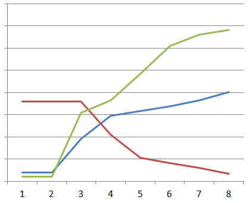

<p align="center">Министерство образования Республики Беларусь</p>
<p align="center">Учреждение образования</p>
<p align="center">"Брестский Государственный технический университет"</p>
<p align="center">Кафедра ИИТ</p>
<br>
<br>
<p align="center">Лабораторная работа №2</p>
<p align="center">По дисциплине: "Общая теория интеллектуальных систем"</p>
<p align="center">Тема: "ПИД-регуляторы"</p>
<br>
<br>
<p align="right">Выполнил:<br>Студент 2 курса<br>Группы ИИ-24<br>Бузель С. Д.</p>
<p align="right">Проверил:<br>Иванюк Д. С.</p>
<br>
<p align="center">Брест 2023</p>

---

# Общее задание #
1. Написать отчет по выполненной лабораторной работе №2 в .md формате (*readme.md*) и с помощью **pull request** разместить его в следующем каталоге: **trunk\ii0xxyy\task_02\doc**.
2. Исходный код написанной программы разместить в каталоге: **trunk\ii00xxyy\task_02\src**.
---

# Выполнение задания #

Вывод программы:
```
value:
2,2,9.54488,14.7205,15.8424,16.9143,18.2768,20.0918,

signal:
18,18,18,10.4551,5.27954,4.15761,3.08572,1.72325,

setting:
1,1,15.4,18.2769,24.2237,30.4979,33.0028,34.1701,
```

