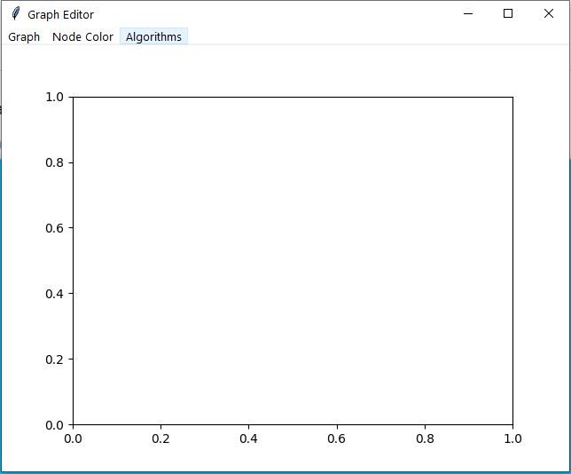
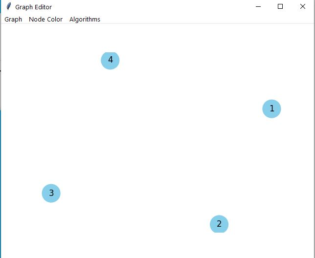
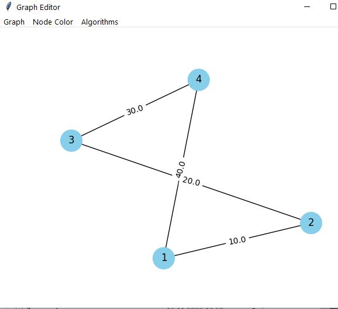
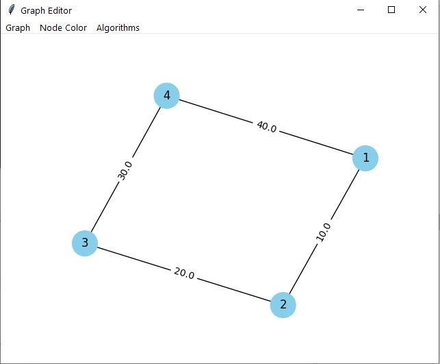
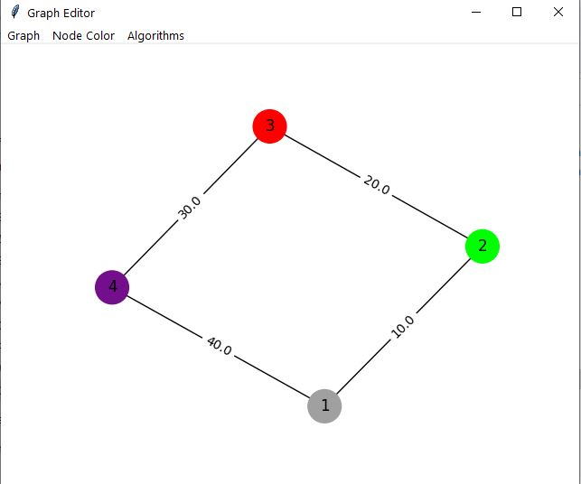
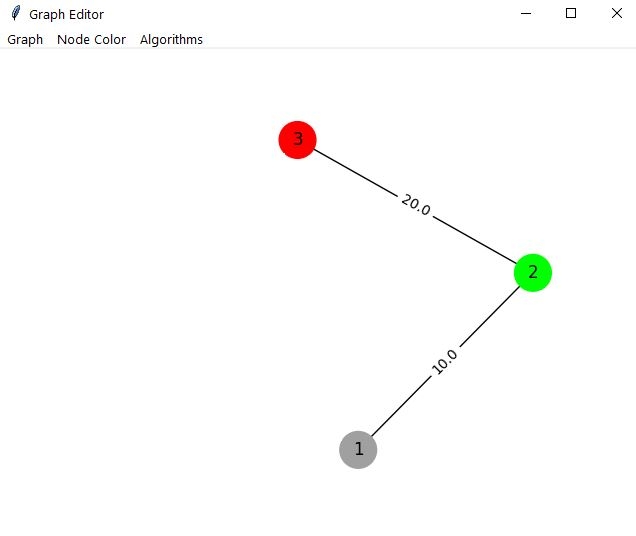
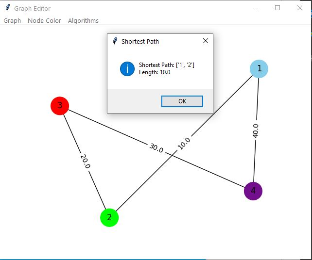
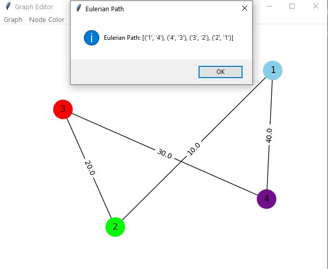

 Министерство образования Республики Беларусь

Учреждение образования

“Брестский Государственный технический университет”

Кафедра ИИТ

       

Лабораторная работа №3

По дисциплине “Общая теория интеллектуальных систем”

Тема: “Разработка редакторов графов”

     

Выполнил:

Студент 2 курса

Группы ИИ-24

Капуза Н. А.

Проверил:

Иванюк Д. С.

     

Брест 2023

---

# Задание 
1. Разработать и реализовать программный продукт позволяющий редактировать графовые конструкции различных видов и производить над ними различные действия. Язык программирования - любой.

2. Редактор должен позволять :
a) одновременно работать с несколькими графами (MDI);
c) задавать имена графам;
d) сохранять и восстанавливать граф во внутреннем формате программы;
e) экспортировать и импортировать граф в текстовый формат (описание см. ниже);
f) создавать, удалять, именовать, переименовывать, перемещать узлы;
g) создавать ориентированные и неориентированные дуги, удалять дуги;
h) добавлять, удалять и редактировать содержимое узла (содержимое в виде текста и ссылки на файл);
i) задавать цвет дуги и узла, образ узла;

3. Программный продукт должен позволять выполнять следующие операции:
b) поиск всех путей (маршрутов) между двумя узлами и кратчайших;
c) вычисление расстояния между двумя узлами;
d) вычисление диаметра, радиуса, центра графа;
g) нахождения эйлеровых циклов;

4. Формат текстового представления графа: <ГРАФ> ::= <ИМЯ ГРАФА> : UNORIENT | ORIENT ; <ОПИСАНИЕ УЗЛОВ> ; <ОПИСАНИЕ СВЯЗЕЙ> . <ИМЯ ГРАФА> ::= <ИДЕНТИФИКАТОР> <ОПИСАНИЕ УЗЛОВ> ::= <ИМЯ УЗЛА> [ , <ИМЯ УЗЛА> …] <ИМЯ УЗЛА> ::= <ИДЕНТИФИКАТОР> <ОПИСАНИЕ СВЯЗЕЙ> ::= <ИМЯ УЗЛА> -> <ИМЯ УЗЛА> [ , <ИМЯ УЗЛА> …] ; [<ОПИСАНИЕ СВЯЗЕЙ> …]

5. Написать отчет по выполненной лабораторной работе в .md формате (readme.md). Разместить его в следующем каталоге: trunk\ii0xxyy\task_03\doc (где xx - номер группы, yy - номер студента, например ii02404).

6. Исходный код разработанной программы разместить в каталоге: trunk\ii0xxyy\task_03\src.

# Рабочее окно:

# Добавление вершин:

# Cоединение вершин ребрами:

# Перемещение вершин:

# Изменение веса ребер:

# Изменение цвета вершин, ребер:

# Удаление ребер и вершин:

# Кратчайший путь:

# Эйлеров путь:
