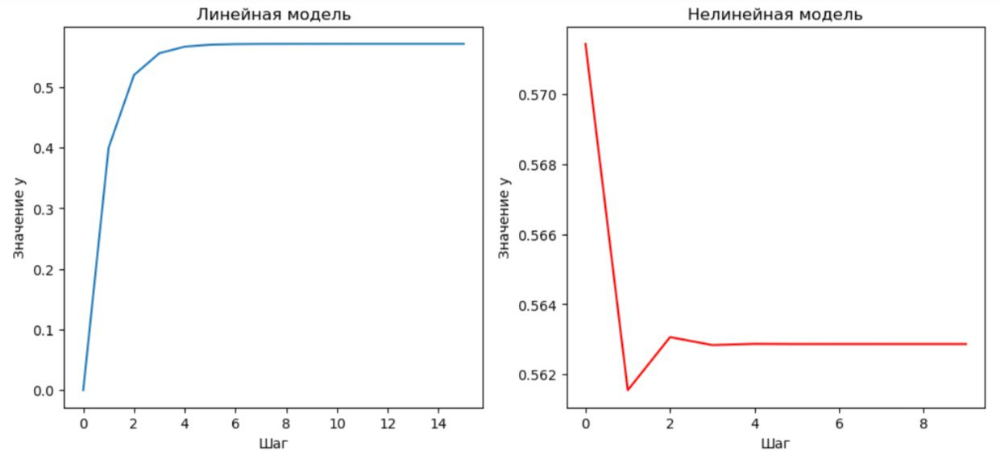

<p align="center"> Министерство образования Республики Беларусь</p>

<p align="center">Учреждение образования</p>

<p align="center">“Брестский Государственный технический университет”</p>

<p align="center">Кафедра ИИТ</p>

<br><br><br><br><br><br><br>

<p align="center">Лабораторная работа №1</p>

<p align="center">По дисциплине “Общая теория интеллектуальных систем”</p>

<p align="center">Тема: “Моделирования температуры объекта”</p>

<br><br><br><br><br>

<p align="right">Выполнила:</p>

<p align="right">Студентка 2 курса</p>

<p align="right">Группы ИИ-24</p>

<p align="right">Коцуба Е. М.</p>

<p align="right">Проверил:</p>

<p align="right">Иванюк Д. С.</p>

<br><br><br><br><br>

<p align="center">Брест 2023</p>

\---

\# Общее задание #

1. Написать отчет по выполненной лабораторной работе №1 в .md формате (readme.md) и с помощью запроса на внесение изменений (\*\*pull request\*\*) разместить его в следующем каталоге: \*\*trunk\ii0xxyy\task\_01\doc\*\* (где \*\*xx\*\* - номер группы, \*\*yy\*\* - номер студента, например \*\*ii02102\*\*).
1. Исходный код написанной программы разместить в каталоге: \*\*trunk\ii0xxyy\task\_01\src\*\*.

\## Task 1. Modeling controlled object ##

Let's get some object to be controlled. We want to control its temperature, which can be described by this differential equation:

$$\Large\frac{dy(\tau)}{d\tau}=\frac{u(\tau)}{C}+\frac{Y\_0-y(\tau)}{RC} $$ (1)

where $\tau$ – time; $y(\tau)$ – input temperature; $u(\tau)$ – input warm; $Y\_0$ – room temperature; $C,RC$ – some constants.

After transformation we get these linear (2) and nonlinear (3) models:

$$\Large y\_{\tau+1}=ay\_{\tau}+bu\_{\tau}$$ (2)

$$\Large y\_{\tau+1}=ay\_{\tau}-by\_{\tau-1}^2+cu\_{\tau}+d\sin(u\_{\tau-1})$$ (3)

where $\tau$ – time discrete moments ($1,2,3{\dots}n$); $a,b,c,d$ – some constants.

Task is to write program (\*\*Julia\*\*), which simulates this object temperature.

\---

\# Выполнение задания #

Код программы:

\```C++

#include <iostream> 
#include <cmath> 
 
const double a = 0.3; 
const double b = 0.4; 
const double c = 0.1; 
const double d = 0.5; 
const double u = 1.0; 
double y = 0.0; 
 
void println(double val) { 
    std::cout << val << std::endl; 
} 
 
double linear(double y_param, int n, int t) { 
    if (n < t) { 
        println(y_param); 
        return linear(a * y_param + b * u, n + 1, t); 
    } 
    println(y_param); 
    return a * y_param + b * u; 
} 
 
int main() { 
    std::cout << "Линейная модель" << std::endl; 
    std::cout << linear(y, 0, 10) << std::endl; 
    std::cout << "                   " << std::endl; 
    std::cout << "Нелинейная модель" << std::endl; 
    println(y); 
    double y_prev = y; 
    double u_prev = u; 
    y = a * y - b * y_prev * y_prev + c * 1.0 + d * sin(1.0); 
    for (int i = 1; i < 10; i++) { 
        println(y); 
        double temp = y; 
        y = a * y - b * y_prev * y_prev + c * u + d * sin(u_prev); 
        y_prev = temp; 
        u_prev = u; 
    } 
    return 0; 
}

\```

Вывод программы:

Линейная модель

0

0\.4

0\.52

0\.556

0\.5668

0\.57004

0\.571012

0\.571304

0\.571391

0\.571417

0\.571425

0\.571428

Нелинейная модель

0

0\.520735

0\.676956

0\.615356

0\.522034

0\.525881

0\.569492

0\.580963

0\.565296

0\.555317


