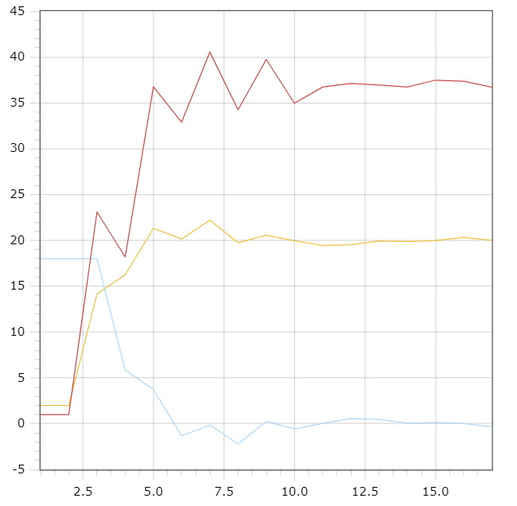

<p align="center"> Министерство образования Республики Беларусь</p>

<p align="center">Учреждение образования</p>

<p align="center">“Брестский Государственный технический университет”</p>

<p align="center">Кафедра ИИТ</p>

<br><br><br><br><br><br><br>

<p align="center">Лабораторная работа №2</p>

<p align="center">По дисциплине “Общая теория интеллектуальных систем”</p>

<p align="center">Тема: “ПИД-Регуляторы”</p>

<br><br><br><br><br>

<p align="right">Выполнила:</p>

<p align="right">Студентка 2 курса</p>

<p align="right">Группы ИИ-24</p>

<p align="right">Коцуба Е. М.</p>

<p align="right">Проверил:</p>

<p align="right">Иванюк Д. С.</p>

<br><br><br><br><br>

<p align="center">Брест 2023</p>

\---

\# Общее задание #

1. Написать отчет по выполненной лабораторной работе №2 в .md формате (readme.md) и с помощью запроса на внесение изменений (\*\*pull request\*\*) разместить его в следующем каталоге: \*\*trunk\ii0xxyy\task\_01\doc\*\* (где \*\*xx\*\* - номер группы, \*\*yy\*\* - номер студента, например \*\*ii02102\*\*).
1. Исходный код написанной программы разместить в каталоге: \*\*trunk\ii0xxyy\task\_01\src\*\*.


\# Выполнение задания #

Код программы:

\```C++

#include <iostream>
#include <vector>
#include <cmath>

const double A = 0.5;
const double B = 0.6;
const double C = 0.6;
const double D = 0.6;
const double K = 0.9;
const double T0 = 1.5;
const double TD = 2.2;
const double T = 1.1;
const double w = 20;
const double q0 = K * (1 + (TD / T0));
const double q1 = -K * (1 + 2 * (TD / T0) - (T0 / T));
const double q2 = K * (TD / T0);

void unliner() {
    const double y_start = 2;
    std::vector<double> y = { y_start, y_start }; // Вектор для хранения значений переменной y
    double u = 1.0; // Начальное значение управляющей переменной u
    std::vector<double> e = { w - y_start, w - y_start }; // Вектор для хранения значений разности w - y
    std::vector<double> u_pr = { u, u }; // Вектор для хранения значений предыдущей управляющей переменной u

    while (std::abs(w - y.back()) > 0.01) { // Цикл выполняется, пока разница между w и последним значением y больше 0.01
        e.push_back(w - y.back()); // Добавление текущей разности в вектор e
        u = u_pr.back() + q0 * e.back() + q1 * e[e.size() - 2] + q2 * e[e.size() - 3]; // Вычисление нового значения управляющей переменной u
        y.push_back(A * y.back() - B * y[y.size() - 2] + C * u + D * std::sin(u_pr.back())); // Вычисление нового значения переменной y
        u_pr.push_back(u); // Добавление нового значения управляющей переменной u в вектор u_pr
    }

    std::cout << "y\te\tu_pr\n";
    for (std::size_t i = 0; i < y.size(); i++) {
        std::cout << i + 1 << ";" << y[i] << ";" << e[i] << ";" << u_pr[i] << std::endl; // Вывод значений y, e и u_pr на каждой итерации цикла
    }
}

int main() {
    unliner();
    return 0;
}
\```

Вывод программы:

y       e       u_pr
1;2;18;1
2;2;18;1
3;14.1594;18;23.0909
4;16.2578;5.84057;18.1879
5;21.3133;3.74221;36.7479
6;20.1458;-1.31335;32.8872
7;22.2063;-0.145841;40.5405
8;19.7408;-2.20626;34.2463
9;20.5694;0.259175;39.7316
10;19.9509;-0.569366;34.956
11;19.4353;0.049051;36.7238
12;19.5178;0.564681;37.1124
13;19.9305;0.482225;36.9417
14;19.878;0.0694787;36.7261
15;19.9684;0.121992;37.4727
16;20.3342;0.0316282;37.3525
17;20.0013;-0.334233;36.6984


