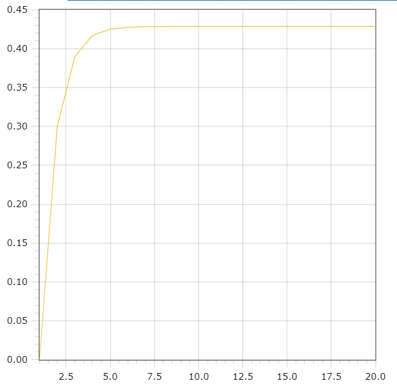
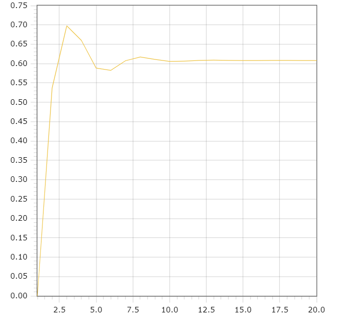

<p style="text-align: center;">Министерство образования Республики Беларусь</p>
<p style="text-align: center;">Учреждение образования</p>
<p style="text-align: center;">“Брестский Государственный технический университет”</p>
<p style="text-align: center;">Кафедра ИИТ</p>
<div style="margin-bottom: 10em;"></div>
<p style="text-align: center;">Лабораторная работа №1</p>
<p style="text-align: center;">По дисциплине “Общая теория интеллектуальных систем”</p>
<p style="text-align: center;">Тема: “Моделирования температуры объекта”</p>
<div style="margin-bottom: 10em;"></div>
<p style="text-align: right;">Выполнил:</p>
<p style="text-align: right;">Студент 2 курса</p>
<p style="text-align: right;">Группы ИИ-24</p>
<p style="text-align: right;"><Крейдич А. А.</p>
<p style="text-align: right;">Проверил:</p>
<p style="text-align: right;">Иванюк Д. С.</p>
<div style="margin-bottom: 10em;"></div>
<p style="text-align: center;">Брест 2023</p>

---

# Общее задание #
1. Написать отчет по выполненной лабораторной работе №1 в .md формате (readme.md) и с помощью запроса на внесение изменений (**pull request**) разместить его в следующем каталоге: trunk\ii0xxyy\task_01\doc (где xx - номер группы, yy - номер студента, например **ii02301**).
2. Исходный код написанной программы разместить в каталоге: **trunk\ii0xxyy\task_01\src**.

## Task 1. Modeling controlled object ##
Let's get some object to be controlled. We want to control its temperature, which can be described by this differential equation:

$$\Large\frac{dy(\tau)}{d\tau}=\frac{u(\tau)}{C}+\frac{Y_0-y(\tau)}{RC} $$ (1)

where $\tau$ – time; $y(\tau)$ – input temperature; $u(\tau)$ – input warm; $Y_0$ – room temperature; $C,RC$ – some constants.

After transformation we get these linear (2) and nonlinear (3) models:

$$\Large y_{\tau+1}=ay_{\tau}+bu_{\tau}$$ (2)
$$\Large y_{\tau+1}=ay_{\tau}-by_{\tau-1}^2+cu_{\tau}+d\sin(u_{\tau-1})$$ (3)

where $\tau$ – time discrete moments ($1,2,3{\dots}n$); $a,b,c,d$ – some constants.

Task is to write program (**C++**), which simulates this object temperature.

---

# Выполнение задания #

Код программы:
```C++
#include <iostream>
#include <cmath>

double computeNextLinearValue(double A, double B, double U, double& Y) {
    Y = A * Y + B * U;
    return Y;
}

void printLinearOutput(double A, double B, double U, double Y, int T) {
    std::cout << "Linear model" << std::endl;
    for (int N = 0; N < T; ++N) {
        std::cout << Y << std::endl;
        computeNextLinearValue(A, B, U, Y);
    }
    std::cout << std::endl;
}

double computeNextNonlinearValue(double A, double B, double C, double D, double U, double& Y, double& Y_pre) {
    double nextY;
    if (Y_pre == 0) {
        nextY = A * Y - B * pow(Y_pre, 2) + C * 1 + D * sin(1);
    }
    else {
        nextY = A * Y - B * pow(Y_pre, 2) + C * U + D * sin(U);
    }
    Y_pre = Y;
    Y = nextY;
    return Y;
}

void printNonlinearOutput(double A, double B, double C, double D, double U, double Y, double Y_pre, int T) {
    std::cout << "Nonlinear model" << std::endl;
    for (int I = 0; I < T; ++I) {
        std::cout << Y << std::endl;
        computeNextNonlinearValue(A, B, C, D, U, Y, Y_pre);
    }
}

int main() {
    const double A_linear = 0.3;
    const double B_linear = 0.3;
    const double U_linear = 1.0;
    double Y_linear = 0.0;
    const int T_linear = 20;

    printLinearOutput(A_linear, B_linear, U_linear, Y_linear, T_linear);

    const double A_nonlinear = 0.3;
    const double B_nonlinear = 0.3;
    const double C_nonlinear = 0.2;
    const double D_nonlinear = 0.4;
    const double U_nonlinear = 1.0;
    double Y_nonlinear = 0.0;
    double Y_pre_nonlinear = 0.0;
    const int T_nonlinear = 20;

    printNonlinearOutput(A_nonlinear, B_nonlinear, C_nonlinear, D_nonlinear, U_nonlinear, Y_nonlinear, Y_pre_nonlinear, T_nonlinear);

    return 0;
}


    Вывод:
   Linear model
0
0.3
0.39
0.417
0.4251
0.42753
0.428259
0.428478
0.428543
0.428563
0.428569
0.428571
0.428571
0.428571
0.428571
0.428571
0.428571
0.428571
0.428571
0.428571

Nonlinear model
0
0.536588
0.697565
0.65948
0.588453
0.58265
0.6075
0.616994
0.61097
0.605675
0.606306
0.608428
0.608835
0.608184
0.60784
0.607974
0.60814
0.608141
0.60808
0.608062
```
 Графики:
 
 линейный график :
 
 
 
 нелинейный график:
 
 
