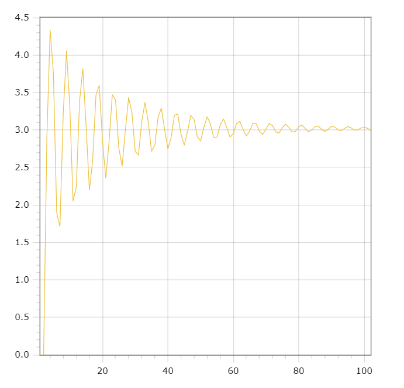

<p align="center"> Министерство образования Республики Беларусь</p>
<p align="center">Учреждение образования</p>
<p align="center">“Брестский Государственный технический университет”</p>
<p align="center">Кафедра ИИТ</p>
<br><br><br><br><br><br><br>
<p align="center">Лабораторная работа №2</p>
<p align="center">По дисциплине “Общая теория интеллектуальных систем”</p>
<p align="center">Тема: “ПИД-регуляторы”</p>
<br><br><br><br><br>
<p align="right">Выполнил:</p>
<p align="right">Студент 2 курса</p>
<p align="right">Группы ИИ-24</p>
<p align="right">Крейдич А.А.</p>
<p align="right">Проверил:</p>
<p align="right">Иванюк Д. С.</p>
<br><br><br><br><br>
<p align="center">Брест 2023</p>

---

# Общее задание #
1. Написать отчет по выполненной лабораторной работе №1 в .md формате (readme.md) и с помощью запроса на внесение изменений (**pull request**) разместить его в следующем каталоге: **trunk\ii0xxyy\task_02\doc** (где **xx** - номер группы, **yy** - номер студента, например **ii02302**).
2. Исходный код написанной программы разместить в каталоге: **trunk\ii0xxyy\task_02\src**.

# Задание #
Задание. На C++ реализовать программу, моделирующую рассмотренный выше ПИД-регулятор. В качестве объекта управления использовать математическую модель, полученную в предыдущей работе. В отчете также привести графики для разных заданий температуры объекта, пояснить полученные результаты.
---
# Код программы: #
```C++    
#include <iostream>
#include <cmath>
#include <vector>

using namespace std;

class MyModel
{
private:
    double coefficientA;
    double coefficientB;
    double coefficientC;
    double coefficientD;

    double parameter0;
    double parameter1;
    double parameter2;

    vector<double> parameters;
    vector<double> residuals = { 0, 0, 0 };
    vector<double> states = { 0, 0, 0 };
    vector<double> variables = { 1, 1 };

public:
    MyModel(double a, double b, double c, double d)
        : coefficientA(a), coefficientB(b), coefficientC(c), coefficientD(d), parameter0(coefficientA* (1 + coefficientC / coefficientD)),
        parameter1(-coefficientA * (1 + 2 * coefficientC / coefficientD - coefficientD / coefficientB)), parameter2(coefficientA* coefficientC / coefficientD),
        parameters({ parameter0, parameter1, parameter2 }) {}

    double calculateTotal()
    {
        double total = 0;
        for (int i = 0; i < 3; i++)
        {
            total += parameters[i] * residuals[i];
        }
        return total;
    }

    void simulate(int steps, double target, double x = 0.5, double y = 0.3, double w = 0.9, double s = 0.7)
    {
        for (int i = 0; i < steps; i++)
        {
            residuals[0] = target - states[states.size() - 1];
            residuals[1] = target - states[states.size() - 2];
            residuals[2] = target - states[states.size() - 3];
            variables[0] = variables[1] + calculateTotal();
            states.push_back(x * states[states.size() - 1] - y * states[states.size() - 2] * states[states.size() - 2] + w * variables[0] + s * sin(variables[1]));
            variables[1] = variables[0];
        }
    }

    vector<double> getStates() const
    {
        return states;
    }
};

int main()
{
    double target;
    MyModel model(0.0001, 100, 100, 1);

    cout << "Введите целевое значение: ";
    cin >> target;
    model.simulate(100, target);
    vector<double> stateValues = model.getStates();

    for (int i = 0; i < stateValues.size(); i++)
    {
        double scaledValue = stateValues[i] * target / stateValues[stateValues.size() - 1];
        cout << i << " " << scaledValue << endl;
    }

    return 0;
}
```
Вывод:
```

Введите целевое значение: 3
1 0
2 0
3 2.90841
4 4.33618
5 3.75281
6 1.89623
7 1.71199
8 3.22056
9 4.05531
10 3.32929
11 2.05008
12 2.24498
13 3.38819
14 3.81703
15 3.04508
16 2.19809
17 2.59354
18 3.46245
19 3.59683
20 2.86057
21 2.35743
22 2.83735
23 3.47081
24 3.39945
25 2.75576
26 2.51711
27 3.00488
28 3.43395
29 3.23251
30 2.71336
31 2.66535
32 3.11244
33 3.36938
34 3.10089
35 2.71631
36 2.79393
37 3.17264
38 3.29181
39 3.00552
40 2.7487
41 2.8985
42 3.19662
43 3.21283
44 2.94383
45 2.79702
46 2.978
47 3.19452
48 3.14067
49 2.91077
50 2.85085
51 3.03373
52 3.17535
53 3.08031
54 2.90002
55 2.90288
56 3.06859
57 3.14673
58 3.03398
59 2.90506
60 2.94854
61 3.08638
62 3.11471
63 3.00172
64 2.91995
65 2.98548
66 3.09117
67 3.08366
68 2.98212
69 2.93977
70 3.01302
71 3.0869
72 3.05642
73 2.9729
74 2.96078
75 3.03164
76 3.07709
77 3.03451
78 2.97147
79 2.98045
80 3.04252
81 3.0646
82 3.01838
83 2.97532
84 2.99723
85 3.04722
86 3.05162
87 3.00772
88 2.98226
89 3.01041
90 3.04736
91 3.03964
92 3.00177
93 2.9905
94 3.01989
95 3.04449
96 3.02955
97 2.99955
98 2.99877
99 3.02597
100 3.03992
101 3.02174
102 3
```

