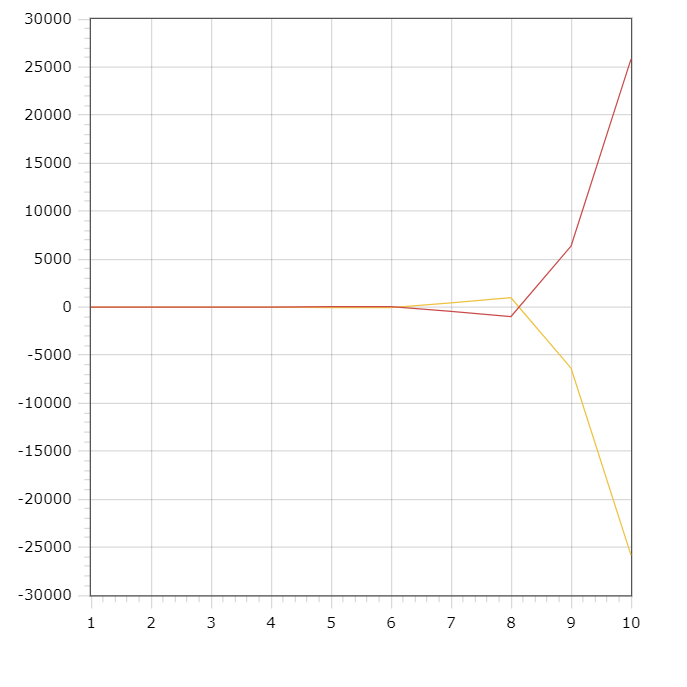

<p align="center">Министерство образования Республики Беларусь</p>
<p align="center">Учреждение образования</p>
<p align="center">"Брестский Государственный технический университет"</p>
<p align="center">Кафедра ИИТ</p>
<br>
<br>
<p align="center">Лабораторная работа №2</p>
<p align="center">По дисциплине: "Общая теория интеллектуальных систем"</p>
<p align="center">Тема: "ПИД-регуляторы"</p>
<br>
<br>
<p align="right">Выполнил:<br>Студент 2 курса<br>Группы ИИ-24<br>Крупич Д. Д.</p>
<p align="right">Проверил:<br>Иванюк Д. С.</p>
<br>
<p align="center">Брест 2023</p>

---

# Общее задание #
1. Написать отчет по выполненной лабораторной работе №2 в .md формате (*readme.md*) и с помощью **pull request** разместить его в следующем каталоге: **trunk\ii0xxyy\task_02\doc**.
2. Исходный код написанной программы разместить в каталоге: **trunk\ii00xxyy\task_02\src**.
---

# Выполнение задания #

Код программы:
```C++

#include <iostream>
#include <cmath>

class NonLinearModel {
    double K0;
    double time;
    double alpha;
    double beta;
    double gamma;
    double delta;
    double y_nonLin1;
    double y_nonLin2;
    double t_nonLin1;
    double t_nonLin0;
    double l1;
    double l2;
    double en;
    double Q;
    double P;
    double TD;
    double j;

public:
    NonLinearModel(double k0, double t, double a, double b, double g, double d, double y1, double y2, double t1, double t0, double q, double p, double td, double j)
        : K0(k0), time(t), alpha(a), beta(b), gamma(g), delta(d), y_nonLin1(y1), y_nonLin2(y2), t_nonLin1(t1), t_nonLin0(t0), l1(0), l2(0), en(0), Q(q), P(p), TD(td), j(j) {}

    void calculate() {
        for (double k = K0; k <= time; k++) {
            double q0 = Q * (1 + TD / k);
            double q1 = -Q * (1 + 2 * TD / k - k / P);
            double q2 = Q * TD / k;
            l1 = j - y_nonLin1;
            l2 = j - y_nonLin2;
            double y_nonlin3 = alpha * y_nonLin2 - beta * pow(abs(y_nonLin1), 2) + gamma * t_nonLin1 + delta * sin(t_nonLin0);
            y_nonLin1 = y_nonLin2;
            y_nonLin2 = y_nonlin3;
            en = j - y_nonlin3;
            double t_nonlin_n = t_nonLin1 + q0 * en + q1 * l2 + q2 * l1;
            l1 = l2;
            l2 = en;
            t_nonLin0 = t_nonLin1;
            t_nonLin1 = t_nonlin_n;
            std::cout << k << "\t" << y_nonlin3 << "\t:\t" << en << std::endl;
        }
    }
};

int main() {
    setlocale(LC_ALL, "ru");
    std::cout << std::endl;
    std::cout << "Нелинейная модель: \n" << std::endl;
    NonLinearModel model(1, 10, 0.002, 0.005, 0.45, 0.007, 0.2, 0.04, 0.1, 0.0025, 0.04, 0.01, 1.7, 1.5);
    model.calculate();
    return 0;
}
```
Вывод программы:
```
Нелинейная модель:

1       0.0448975       :       1.4551
2       2.66865 :       -1.16865
3       7.82184 :       -6.32184
4       1.36276 :       0.137242
5       -44.2252        :       45.7252
6       -41.7234        :       43.2234
7       442.059 :       -440.559
8       977.892 :       -976.392
9       -6343.31        :       6344.81
10      -25821.3        :       25822.8
```
