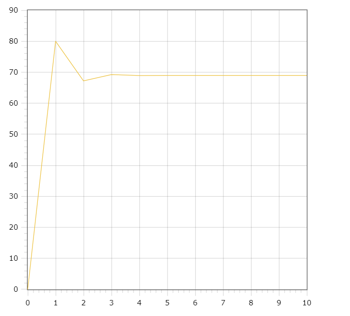

<p align="center">Министерство образования Республики Беларусь</p>
<p align="center">Учреждение образования</p>
<p align="center">"Брестский Государственный технический университет"</p>
<p align="center">Кафедра ИИТ</p>
<br>
<br>
<p align="center">Лабораторная работа №2</p>
<p align="center">По дисциплине: "Общая теория интеллектуальных систем"</p>
<p align="center">Тема: "ПИД-регуляторы"</p>
<br>
<br>
<p align="right">Выполнил:<br>Студент 2 курса<br>Группы ИИ-24<br>Крупич Д. Д.</p>
<p align="right">Проверил:<br>Иванюк Д. С.</p>
<br>
<p align="center">Брест 2023</p>

---

# Общее задание #
1. Написать отчет по выполненной лабораторной работе №2 в .md формате (*readme.md*) и с помощью **pull request** разместить его в следующем каталоге: **trunk\ii0xxyy\task_02\doc**.
2. Исходный код написанной программы разместить в каталоге: **trunk\ii00xxyy\task_02\src**.
---

# Выполнение задания #

Код программы:
```C++
#include <iostream>
#include <vector>

int main() {
    // pid setups
    double kp = 10;
    double ki = 1;
    double kd = 2;
    double t = 0;
    double dt = 1;
    double T = 10;
    double setpoint = 500;
    double in = 0;
    double prevErr = 0;

    // models setups
    double a = 0.5;
    double b = 0.04;

    std::vector<double> outs;
    std::vector<double> results;
    std::vector<double> times;
    std::vector<double> setpoints;
    while (T >= t) {
        // count pid coefficients
        double err = setpoint - in;
        double out = ki * err + ki * err * dt + kd * (err - prevErr) / dt;
        prevErr = err;
        //write data in arrays to draw a graph
        results.push_back(in);
        times.push_back(t);
        outs.push_back(out);
        setpoints.push_back(setpoint);

        in = a * in + b * out;
        t += dt;
    }

    for (double result : results) {
        std::cout << result << std::endl;
    }

    return 0;
}
```
Вывод программы:
```
0
80
67.2
69.248
68.9203
68.9727
68.9644
68.9657
68.9655
68.9655
68.9655

```

