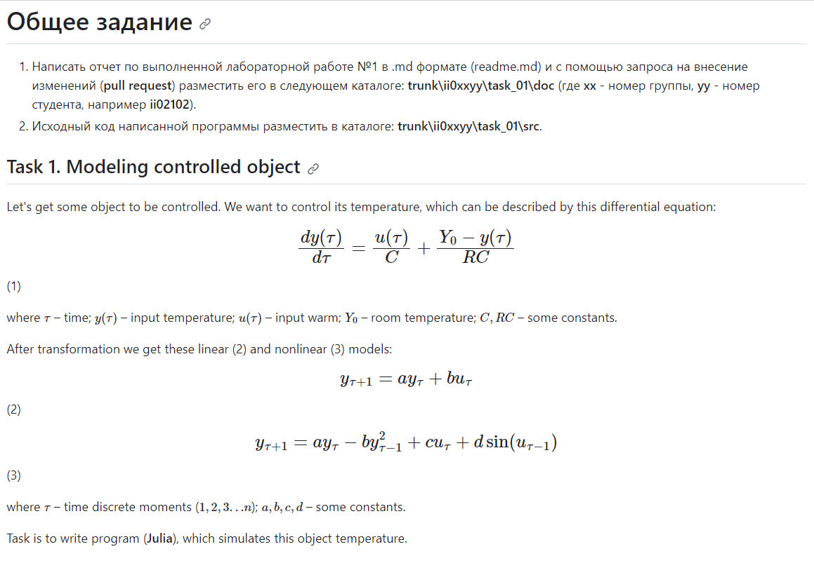

Министерство образования Республики Беларусь
Учреждение образования
«Брестский государственный технический университет»
Кафедра ИИТ

Лабораторная работа №1
За третий семестр
По дисциплине: «Общая теория интеллектуальных систем»
Тема: «Modeling controlled object»

Выполнил:
Студент 2 курса
Группы ИИ-24
Кураш А. Ю.

Проверил:
Иванюк Д.С.

Брест 2023

**График:**

