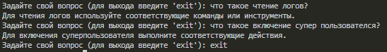

<p align="center"> Министерство образования Республики Беларусь</p>
<p align="center">Учреждение образования</p>
<p align="center">“Брестский Государственный технический университет”</p>
<p align="center">Кафедра ИИТ</p>
<br><br><br><br><br><br><br>
<p align="center">Лабораторная работа №6</p>
<p align="center">По дисциплине “Общая теория интеллектуальных систем”</p>
<p align="center">Тема: “Создание базы знаний для проекта "NIKA" (Intelligent Knowledge-driven Assistant)”</p>
<br><br><br><br><br>
<p align="right">Выполнил:</p>
<p align="right">Студент 2 курса</p>
<p align="right">Группы ИИ-24</p>
<p align="right">Кураш А. Ю.</p>
<p align="right">Проверил:</p>
<p align="right">Иванюк Д. С.</p>
<br><br><br><br><br>
<p align="center">Брест 2023</p>

---

# Общее задание 

1. Изучить руководство.
2. Составить базу знаний для проекта T1-PLCnext-Demo.
3. Разработанную базу знаний поместить в виде запроса в T1-PLCnext-Demo-OSTIS.
4. Написать отчет по выполненной работе в .md формате (readme.md) и с помощью pull request разместить его в следующем каталоге: trunk\ii0xxyy\task_06\doc.


# ЗАПРОС НА ВНЕСЕНИЕ БЗ: https://github.com/savushkin-r-d/T1-PLCnext-Demo-OSTIS/issues/1
# БАЗА ЗНАНИЙ ДЛЯ "САВУШКИЙ ПРОДУКТ":

1. Определение фактов:

    "Запуск в режиме эмуляции позволяет эмулировать работу системы на компьютере."
    "Клонирование проекта позволяет получить копию исходного кода и настроек проекта."
    "Visual Studio Code - интегрированная среда разработки, используемая для разработки программного обеспечения."
    "Git LFS (Large File Storage) - расширение Git для работы с большими файлами."
    "DbEditorXML - инструмент для редактирования XML-файлов с данными."
    "EasyServer - программное обеспечение для создания и настройки сервера."
    "Monitor - инструмент для мониторинга и отладки процессов."
2. Правила вывода:

    Если проект успешно склонирован, то можно приступать к установке и настройке необходимых инструментов.
    Если контроллер имеет установленную прошивку, можно проверить ее текущую версию через веб-браузер.
    Если необходимо обновить прошивку контроллера, можно использовать веб-браузер или командную оболочку.
    Если создан проект в среде PLCnext Engineer, можно настроить сетевые параметры контроллера и подключиться к нему.
    Если требуется управлять выполнением проекта, можно использовать функции включения/выключения, чтения логов и управления ходом выполнения.
3. Онтология:

    Классы: Режим эмуляции, Проект, Интегрированная среда разработки, Git LFS, DbEditorXML, EasyServer, Monitor, Прошивка, Контроллер, PLCnext Engineer, Сетевые настройки, Логи.
    Отношения: Позволяет, Используется для, Проверка, Обновление, Создание, Работа с, Задание, Подключение, Копирование, Включение, Активация, Деактивация, Чтение, Запуск, Управление.
    Интерпретация естественного языка:

# Пример кода для модуля, который позволяет системе обрабатывать вопросы пользователей, например:
"Что такое эмуляция и зачем она нужна?" - Система извлекает факт "Запуск в режиме эмуляции позволяет эмулировать работу системы на компьютере" и отвечает "Эмуляция позволяет воспроизвести работу системы на компьютере без физического устройства для тестирования и отладки."
"Как обновить прошивку контроллера?" - Система применяет правило "Если контроллер имеет установленную прошивку, можно проверить ее текущую версию через веб-браузер" и отвечает "Чтобы обновить прошивку контроллера, вы можете использовать веб-браузер для проверки текущей версии и загрузки новой прошивки."
"Как запустить проект?" - Система применяет правило "Если создан проект в среде PLCnext Engineer, можно запустить его" и отвечает "Для запуска проекта в среде PLCnext Engineer выберите опцию 'Запуск' из соответствующего меню или панели инструментов."

# Module.py

```python
import difflib


class KnowledgeBase:
    def __init__(self):
        self.facts = {
            "Запуск в режиме эмуляции": "Запуск в режиме эмуляции позволяет эмулировать работу системы на компьютере.",
            "Клонирование проекта": "Клонирование проекта позволяет получить копию исходного кода и настроек проекта.",
            "Visual Studio Code": "Visual Studio Code - интегрированная среда разработки, используемая для разработки программного обеспечения.",
            "Git LFS": "Git LFS (Large File Storage) - расширение Git для работы с большими файлами.",
            "DbEditorXML": "DbEditorXML - инструмент для редактирования XML-файлов с данными.",
            "EasyServer": "EasyServer - программное обеспечение для создания и настройки сервера.",
            "Monitor": "Monitor - инструмент для мониторинга и отладки процессов.",
            "Проверка текущей версии прошивки через веб-браузер": "Если контроллер имеет установленную прошивку, можно проверить ее текущую версию через веб-браузер.",
            "Обновление прошивки через веб-браузер": "Если необходимо обновить прошивку контроллера, можно использовать веб-браузер.",
            "Обновление прошивки контроллера через командную оболочку": "Если необходимо обновить прошивку контроллера, можно использовать командную оболочку.",
            "Создание проекта PLCnext Engineer": "Для создания проекта в среде PLCnext Engineer используйте соответствующие инструменты.",
            "Работа с проектом в среде PLCnext Engineer": "При работе с проектом в среде PLCnext Engineer можно использовать различные функции и инструменты.",
            "Задание сетевых настроек контроллера": "Для настройки сетевых параметров контроллера используйте соответствующие настройки.",
            "Подключение к контроллеру в программе PLCnext Engineer": "Для подключения к контроллеру в программе PLCnext Engineer используйте функцию подключения.",
            "Обновление библиотеки": "Для обновления библиотеки в проекте используйте соответствующие инструменты.",
            "Копирование Lua-файлов проекта": "Для копирования Lua-файлов проекта используйте соответствующие команды или инструменты.",
            "Включение суперпользователя": "Для включения суперпользователя выполните соответствующие действия.",
            "Активация входа по SSH в качестве пользователя root": "Для активации входа по SSH в качестве пользователя root выполните соответствующие действия.",
            "Деактивация входа по SSH в качестве пользователя root": "Для деактивации входа по SSH в качестве пользователя root выполните соответствующие действия.",
            "Чтение логов": "Для чтения логов используйте соответствующие команды или инструменты.",
            "Запуск проекта": "Для запуска проекта используйте соответствующие команды или инструменты.",
            "Управление ходом выполнения проекта": "Для управления ходом выполнения проекта используйте соответствующие командыили инструменты."
        }

    def get_answer(self, question):
        # Преобразуем вопрос в нижний регистр и удаляем знаки препинания
        question = question.lower().strip("?.,!")

        # Поиск соответствующего факта в базе знаний
        if question in self.facts:
            return self.facts[question]
        else:
            # Поиск наиболее похожего вопроса в базе
            closest_match = difflib.get_close_matches(question, self.facts.keys(), n=1, cutoff=0.5)
            if closest_match:
                return self.facts[closest_match[0]]
            else:
                return "Извините, я не могу найти ответ на ваш вопрос."

# Создаем экземпляр класса KnowledgeBase
knowledge_base = KnowledgeBase()

# Пример использования модуля
while True:
    user_question = input("Задайте свой вопрос (для выхода введите 'exit'): ")
    
    if user_question.lower() == "exit":
        break

    answer = knowledge_base.get_answer(user_question)
    print(answer)
```

#console:

