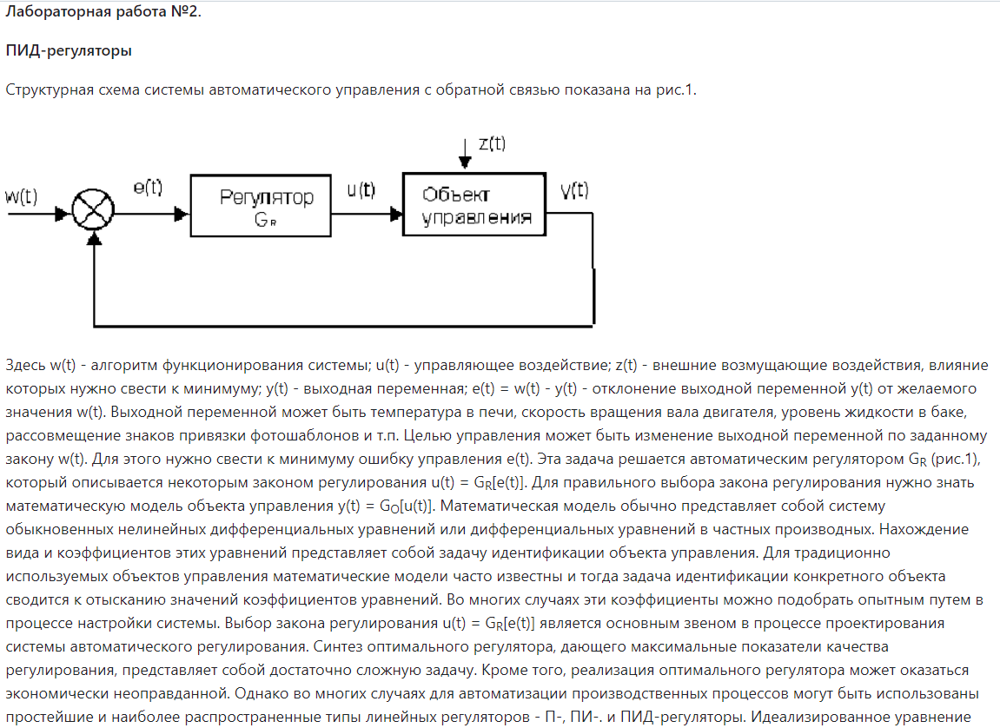
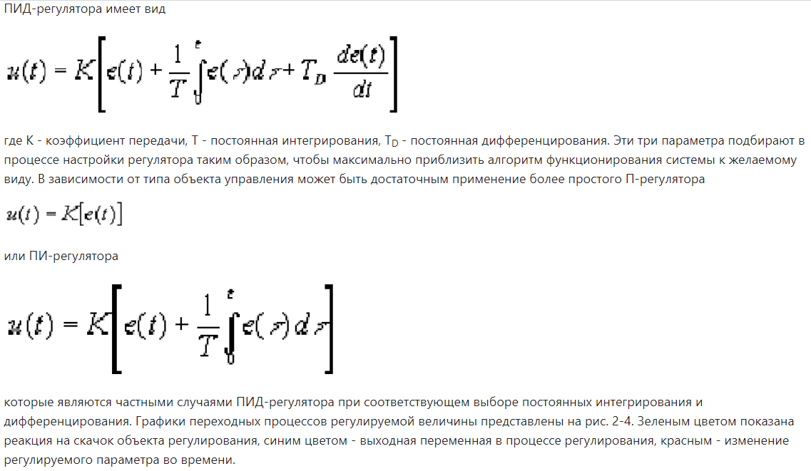

<p align="center"> Министерство образования Республики Беларусь</p>
<p align="center">Учреждение образования</p>
<p align="center">“Брестский Государственный технический университет”</p>
<p align="center">Кафедра ИИТ</p>
<br><br><br><br><br><br><br>
<p align="center">Лабораторная работа №1</p>
<p align="center">По дисциплине “Общая теория интеллектуальных систем”</p>
<p align="center">Тема: “ПИД-регуляторы”</p>
<br><br><br><br><br>
<p align="right">Выполнил:</p>
<p align="right">Студент 2 курса</p>
<p align="right">Группы ИИ-24</p>
<p align="right">Кураш А. Ю.</p>
<p align="right">Проверил:</p>
<p align="right">Иванюк Д. С.</p>
<br><br><br><br><br>
<p align="center">Брест 2023</p>

---

# Общее задание #
1. Написать отчет по выполненной лабораторной работе №1 в .md формате (readme.md) и с помощью запроса на внесение изменений (**pull request**) разместить его в следующем каталоге: **trunk\ii0xxyy\task_01\doc** (где **xx** - номер группы, **yy** - номер студента, например **ii02102**).
2. Исходный код написанной программы разместить в каталоге: **trunk\ii0xxyy\task_01\src**.

{: width="800px" height="900px"}
{: width="800px" height="700px"}
{: width="800px" height="00px"}
{: width="800px" height="900px"}

```c++
#include <iostream>
#include <vector>

double K = 0.097;    // пропорциональная составляющая
double T = 2.1623;   // интегральная составляющая
double Td = 1.0;     // дифференциальная составляющая
double step = 1.0;     // шаг

double q0 = K * (1 + Td / step);
double q1 = -K * (1 + 2 * Td / step - step / T);
double q2 = (K * Td) / step;

// функция подсчёта линейной модели
double linear_model(double y, double parram_a, double parram_b, double u) {
    y = parram_a * y + parram_b * u; // формула линейной модели
    return y;
}

int count = 100;      // количество итераций
double point = 29.0;  // желаемое значение

void mainFunction() {
    std::cout << "START" << std::endl;
    std::vector<double> arr_LinY;  // массив текущих значений
    std::vector<double> arr_u;     // массив управляющих сигналов
    double parram_a = 0.8;
    double parram_b = 0.3;
    double y = 0.0;
    double PrevU = 0.0;
    double u = 0.0;
    double du = 0.0;
    std::vector<double> arr_e = { 0.0, 0.0, 0.0 }; // массив разности желаемого значения и текущего значения

    // цикл вычисления Y для линейной модели
    for (int i = 1; i <= count; i++) {
        arr_e[2] = arr_e[1];
        arr_e[1] = abs(point - y);
        du = q0 * arr_e[1] + q1 * arr_e[2] + q2 * arr_e[3]; // вычисление изменения управляющего сигнала
        PrevU = u;
        u = PrevU + du;
        y = linear_model(y, parram_a, parram_b, u); // вычисление текущего значения
        arr_LinY.push_back(y);  // добавляем в массив текущее значение
        arr_u.push_back(u);     // добавляем в массив управляющий сигнал
        std::cout << i << ". y = " << y << "\t| u = " << u << std::endl;
    }
}

int main() {
    mainFunction();
    return 0;
}
```

# console:
START
1. y = 1.6878           |u = 5.626
2. y = 2.46802          |u = 3.72593
3. y = 2.61166          |u = 2.12414
4. y = 2.31987          |u = 0.76849
5. y = 1.67975          |u = -0.587159       
6. y = 0.819158         |u = -1.74881        
7. y = -0.233453        |u = -2.9626 
8. y = -1.45532         |u = -4.22853        
9. y = -2.82824         |u = -5.5466
10. y = -4.33763        | u = -6.91681
11. y = -5.91365        | u = -8.14516
12. y = -7.63246        | u = -9.67179
13. y = -9.42294        | u = -11.0566
14. y = -11.302         | u = -12.5456        
15. y = -13.2833        | u = -14.139 
16. y = -15.3776        | u = -15.8366
17. y = -17.5936        | u = -17.6385
18. y = -19.9383        | u = -19.5446
19. y = -22.4172        | u = -21.5551
20. y = -24.9765        | u = -23.4758
21. y = -27.7053        | u = -25.747 
22. y = -30.5428        | u = -27.9284
23. y = -33.5141        | u = -30.2663
24. y = -36.6394        | u = -32.7606
25. y = -39.9349        | u = -35.4113
26. y = -43.4135        | u = -38.2184
27. y = -47.0272        | u = -40.9879
28. y = -50.8115        | u = -43.966 
29. y = -54.8532        | u = -47.3467
30. y = -59.0895        | u = -50.6898
31. y = -63.4859        | u = -54.0475
32. y = -68.1466        | u = -57.8598
33. y = -73.0233        | u = -61.6867
34. y = -78.151         | u = -65.7743        
35. y = -83.5576        | u = -70.1226
36. y = -89.2655        | u = -74.7317
37. y = -95.2347        | u = -79.4074
38. y = -101.507        | u = -84.3959
39. y = -108.114        | u = -89.6974
40. y = -115.027        | u = -95.1176
41. y = -122.292        | u = -100.903
42. y = -129.95         | u = -107.053
43. y = -138.03         | u = -113.568
44. y = -146.442        | u = -120.06
45. y = -155.319        | u = -127.216
46. y = -164.633        | u = -134.594
47. y = -174.439        | u = -142.442
48. y = -184.721        | u = -150.565
49. y = -195.54         | u = -159.21
50. y = -206.886        | u = -168.182
51. y = -218.827        | u = -177.727
52. y = -231.357        | u = -187.652
53. y = -244.489        | u = -198.009
54. y = -258.304        | u = -209.043
55. y = -272.812        | u = -220.562
56. y = -288.092        | u = -232.81
57. y = -304.094        | u = -245.4
58. y = -320.922        | u = -258.825
59. y = -338.663        | u = -273.083
60. y = -357.267        | u = -287.788
61. y = -376.785        | u = -303.238
62. y = -397.331        | u = -319.678
63. y = -418.881        | u = -336.721
64. y = -441.563        | u = -354.859
65. y = -465.361        | u = -373.703
66. y = -490.355        | u = -393.553
67. y = -516.622        | u = -414.461
68. y = -544.241        | u = -436.478
69. y = -573.231        | u = -459.462
70. y = -603.699        | u = -483.713
71. y = -635.743        | u = -509.281
72. y = -669.402        | u = -536.026
73. y = -704.737        | u = -564.051
74. y = -741.886        | u = -593.655
75. y = -780.918        | u = -624.696
76. y = -821.918        | u = -657.278
77. y = -864.986        | u = -691.505
78. y = -910.233        | u = -727.483
79. y = -957.723        | u = -765.12
80. y = -1007.67        | u = -804.962
81. y = -1060.14        | u = -846.672
82. y = -1115.23        | u = -890.408
83. y = -1173.14        | u = -936.519
84. y = -1233.99        | u = -984.915
85. y = -1297.97        | u = -1035.95
86. y = -1365.18        | u = -1089.33
87. y = -1435.73        | u = -1145.28
88. y = -1509.9         | u = -1204.38
89. y = -1587.82        | u = -1266.36
90. y = -1669.69        | u = -1331.42
91. y = -1755.68        | u = -1399.77
92. y = -1846.03        | u = -1471.62
93. y = -1940.92        | u = -1546.99
94. y = -2040.69        | u = -1626.51
95. y = -2145.49        | u = -1709.78
96. y = -2255.57        | u = -1797.29
97. y = -2371.25        | u = -1889.3
98. y = -2492.76        | u = -1985.88
99. y = -2620.47        | u = -2087.55
100. y = -2754.63       | u = -2194.16