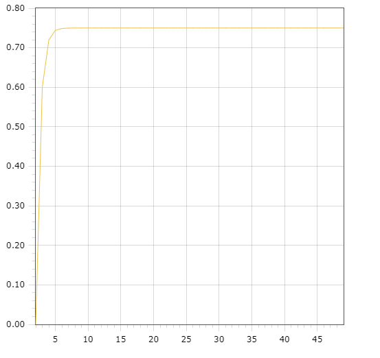

Министерство образования Республики Беларусь <br/>
Учреждение образования <br/>
«Брестский государственный технический университет» <br/>
Кафедра ИИТ <br/>

Лабораторная работа №1 <br/>
За третий семестр <br/>
По дисциплине: «Общая теория интеллектуальных систем» <br/>
Тема: «Modeling controlled object» <br/>

Выполнил: <br/>
Студент 2 курса <br/>
Группы ИИ-24 <br/>
Лящук А.В. <br/>

Проверил: <br/>
Иванюк Д.С. <br/>

Брест 2023 <br/>

# Общее задание #
1. Написать отчет по выполненной лабораторной работе №1 в .md формате (readme.md) и с помощью запроса на внесение изменений (**pull request**) разместить его в следующем каталоге: **trunk\ii0xxyy\task_01\doc** (где **xx** - номер группы, **yy** - номер студента, например **ii02308**).
2. Исходный код написанной программы разместить в каталоге: **trunk\ii0xxyy\task_01\src**.

## Task 1. Modeling controlled object ##
Let's get some object to be controlled. We want to control its temperature, which can be described by this differential equation:

$$\Large\frac{dy(\tau)}{d\tau}=\frac{u(\tau)}{C}+\frac{Y_0-y(\tau)}{RC} $$ (1)

where $\tau$ – time; $y(\tau)$ – input temperature; $u(\tau)$ – input warm; $Y_0$ – room temperature; $C,RC$ – some constants.

After transformation we get these linear (2) and nonlinear (3) models:

$$\Large y_{\tau+1}=ay_{\tau}+bu_{\tau}$$ (2)
$$\Large y_{\tau+1}=ay_{\tau}-by_{\tau-1}^2+cu_{\tau}+d\sin(u_{\tau-1})$$ (3)

where $\tau$ – time discrete moments ($1,2,3{\dots}n$); $a,b,c,d$ – some constants.

Task is to write program (**C++**), which simulates this object temperature.


## Код программы ##


``` C++
#include <iostream>
#include <cmath>

// Calculation of linear model
double CalculateLinear(double y, double coefficientA, double coefficientB, double input) {
    y = coefficientA * y + coefficientB * input;
    return y;
}

// Calculation of nonlinear model
double CalculateNonlinear(double y, double coefficientA, double coefficientB, double previousY, double coefficientC, double input, double coefficientD, double previousInput) {
    y = coefficientA * y - coefficientB * pow(previousY, 2) + coefficientC * input + coefficientD * sin(previousInput);
    return y;
}

int main() {
    const int quantity = 50;
    double linearY[quantity];
    double coefficientA = 0.8;
    double coefficientB = 1.5;
    double y = 0.0;
    double input = 3.3;

    // Linear model
    std::cout << "Linear Model:\n";
    std::cout << "----------------\n";
    for (int i = 0; i < quantity; i++) {
        linearY[i] = y;
        y = CalculateLinear(y, coefficientA, coefficientB, input);
        std::cout << "Step " << i + 1 << ": " << linearY[i] << "\n";
    }

    std::cout << "\n";

    // Nonlinear model
    double nonlinearY[quantity];
    coefficientA = 0.75;
    coefficientB = 0.1;
    double coefficientC = 2.2;
    double coefficientD = 8.5;
    y = 0.0;
    input = 0.3;
    double nextY = 0.0;
    double previousY = 0.0;

    std::cout << "Nonlinear Model:\n";
    std::cout << "-------------------\n";
    for (int i = 0; i < quantity; i++) {
        previousY = y;
        y = nextY;
        nextY = CalculateNonlinear(y, coefficientA, coefficientB, previousY, coefficientC, input, coefficientD, input);
        nonlinearY[i] = nextY;
        std::cout << "Step " << i + 1 << ": " << nonlinearY[i] << "\n";
    }

    return 0;
}
```

Вывод программы:
```
Linear Model:
----------------
Step 1: 0
Step 2: 4.95
Step 3: 8.91
Step 4: 12.078
Step 5: 14.6124
Step 6: 16.6399
Step 7: 18.2619
Step 8: 19.5595
Step 9: 20.5976
Step 10: 21.4281
Step 11: 22.0925
Step 12: 22.624
Step 13: 23.0492
Step 14: 23.3894
Step 15: 23.6615
Step 16: 23.8792
Step 17: 24.0533
Step 18: 24.1927
Step 19: 24.3041
Step 20: 24.3933
Step 21: 24.4647
Step 22: 24.5217
Step 23: 24.5674
Step 24: 24.6039
Step 25: 24.6331
Step 26: 24.6565
Step 27: 24.6752
Step 28: 24.6902
Step 29: 24.7021
Step 30: 24.7117
Step 31: 24.7194
Step 32: 24.7255
Step 33: 24.7304
Step 34: 24.7343
Step 35: 24.7375
Step 36: 24.74
Step 37: 24.742
Step 38: 24.7436
Step 39: 24.7449
Step 40: 24.7459
Step 41: 24.7467
Step 42: 24.7474
Step 43: 24.7479
Step 44: 24.7483
Step 45: 24.7487
Step 46: 24.7489
Step 47: 24.7491
Step 48: 24.7493
Step 49: 24.7494
Step 50: 24.7496

Nonlinear Model:
-------------------
Step 1: 3.17192
Step 2: 5.55086
Step 3: 6.32896
Step 4: 4.83743
Step 5: 2.79442
Step 6: 2.92766
Step 7: 4.58679
Step 8: 5.75489
Step 9: 5.38423
Step 10: 3.89821
Step 11: 3.19659
Step 12: 4.04976
Step 13: 5.18742
Step 14: 5.42243
Step 15: 4.54781
Step 16: 3.6425
Step 17: 3.83554
Step 18: 4.72179
Step 19: 5.24213
Step 20: 4.87399
Step 21: 4.07942
Step 22: 3.85591
Step 23: 4.39969
Step 24: 4.98488
Step 25: 4.97486
Step 26: 4.41816
Step 27: 4.01062
Step 28: 4.22787
Step 29: 4.73432
Step 30: 4.93517
Step 31: 4.63192
Step 32: 4.21027
Step 33: 4.18416
Step 34: 4.5374
Step 35: 4.82426
Step 36: 4.73131
Step 37: 4.39306
Step 38: 4.22819
Step 39: 4.41316
Step 40: 4.69404
Step 41: 4.74485
Step 42: 4.52716
Step 43: 4.31593
Step 44: 4.35935
Step 45: 4.57871
Step 46: 4.70556
Step 47: 4.60463
Step 48: 4.41117
Step 49: 4.36003
Step 50: 4.49611
```


