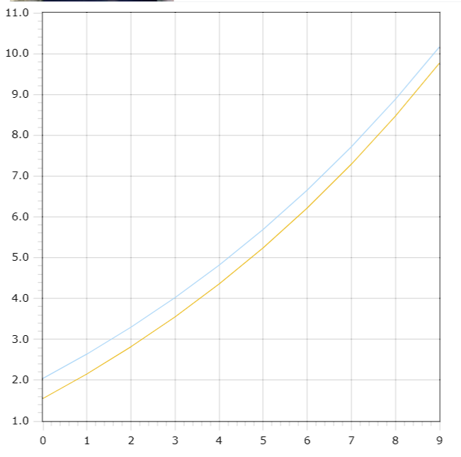

<p style="text-align: center;">Министерство образования Республики Беларусь</p>
<p style="text-align: center;">Учреждение образования</p>
<p style="text-align: center;">“Брестский Государственный технический университет”</p>
<p style="text-align: center;">Кафедра ИИТ</p>
<div style="margin-bottom: 10em;"></div>
<p style="text-align: center;">Лабораторная работа №1</p>
<p style="text-align: center;">По дисциплине “Общая теория интеллектуальных систем”</p>
<p style="text-align: center;">Тема: “Моделирования температуры объекта”</p>
<div style="margin-bottom: 10em;"></div>
<p style="text-align: right;">Выполнил:</p>
<p style="text-align: right;">Студент 2 курса</p>
<p style="text-align: right;">Группы ИИ-24</p>
<p style="text-align: right;">Максимович А. И.</p>
<p style="text-align: right;">Проверил:</p>
<p style="text-align: right;">Иванюк Д. С.</p>
<div style="margin-bottom: 10em;"></div>
<p style="text-align: center;">Брест 2023</p>

---

# Общее задание #
1. Написать отчет по выполненной лабораторной работе №1 в .md формате (readme.md) и с помощью запроса на внесение изменений (**pull request**) разместить его в следующем каталоге: **trunk\ii0xxyy\task_01\doc** (где **xx** - номер группы, **yy** - номер студента, например **ii02302**).
2. Исходный код написанной программы разместить в каталоге: **trunk\ii0xxyy\task_01\src**.

## Task 1. Modeling controlled object ##
Let's get some object to be controlled. We want to control its temperature, which can be described by this differential equation:

$$\Large\frac{dy(\tau)}{d\tau}=\frac{u(\tau)}{C}+\frac{Y_0-y(\tau)}{RC} $$ (1)

where $\tau$ – time; $y(\tau)$ – input temperature; $u(\tau)$ – input warm; $Y_0$ – room temperature; $C,RC$ – some constants.

After transformation we get these linear (2) and nonlinear (3) models:

$$\Large y_{\tau+1}=ay_{\tau}+bu_{\tau}$$ (2)
$$\Large y_{\tau+1}=ay_{\tau}-by_{\tau-1}^2+cu_{\tau}+d\sin(u_{\tau-1})$$ (3)

where $\tau$ – time discrete moments ($1,2,3{\dots}n$); $a,b,c,d$ – some constants.

Task is to write program (**С++**), which simulates this object temperature.


---
# Выполнение задания #
```C++
Код программы:
#include <iostream>
#include <cmath>

// Calculation of linear model
double CalculateLinear(double y, double koef_A, double koef_B, double u) {
    y = koef_A * y + koef_B * u;
    return y;
}

// Calculation of nonlinear model
double CalculateNonlinear(double y, double koef_A, double koef_B, double YPrev, double koef_C, double u, double koef_D, double UPrev) {
    y = koef_A * y - koef_B * pow(YPrev, 2) + koef_C * u + koef_D * sin(UPrev);
    return y;
}

int main() {
    const int quantity = 50;
    double linY[quantity];
    double koef_A = 0.8;
    double koef_B = 1.5;
    double y = 0.0;
    double u = 3.3;

    // Linear model
    for (int i = 0; i < quantity; i++) {
        linY[i] = y;
        y = CalculateLinear(y, koef_A, koef_B, u);
        std::cout << i + 1 << " " << linY[i] << "\n";
    }

    // Nonlinear model
    double unLinY[quantity];
    koef_A = 0.75;
    koef_B = 0.1;
    double koef_C = 2.2;
    double koef_D = 8.5;
    y = 0.0;
    u = 0.3;
    double Ynext = 0.0;
    double Yprev = 0.0;

    for (int i = 0; i < quantity; i++) {
        Yprev = y;
        y = Ynext;
        Ynext = CalculateNonlinear(y, koef_A, koef_B, Yprev, koef_C, u, koef_D, u);
        unLinY[i] = Ynext;
        std::cout << i + 1 << " " << unLinY[i] << "\n";
    }

    return 0;
}
```     

Вывод программы:

1 0
2 4.95
3 8.91
4 12.078
5 14.6124
6 16.6399
7 18.2619
8 19.5595
9 20.5976
10 21.4281
11 22.0925
12 22.624
13 23.0492
14 23.3894
15 23.6615
16 23.8792
17 24.0533
18 24.1927
19 24.3041
20 24.3933
21 24.4647
22 24.5217
23 24.5674
24 24.6039
25 24.6331
26 24.6565
27 24.6752
28 24.6902
29 24.7021
30 24.7117
31 24.7194
32 24.7255
33 24.7304
34 24.7343
35 24.7375
36 24.74
37 24.742
38 24.7436
39 24.7449
40 24.7459
41 24.7467
42 24.7474
43 24.7479
44 24.7483
45 24.7487
46 24.7489
47 24.7491
48 24.7493
49 24.7494
50 24.7496


1 3.17192
2 5.55086
3 6.32896
4 4.83743
5 2.79442
6 2.92766
7 4.58679
8 5.75489
9 5.38423
10 3.89821
11 3.19659
12 4.04976
13 5.18742
14 5.42243
15 4.54781
16 3.6425
17 3.83554
18 4.72179
19 5.24213
20 4.87399
21 4.07942
22 3.85591
23 4.39969
24 4.98488
25 4.97486
26 4.41816
27 4.01062
28 4.22787
29 4.73432
30 4.93517
31 4.63192
32 4.21027
33 4.18416
34 4.5374
35 4.82426
36 4.73131
37 4.39306
38 4.22819
39 4.41316
40 4.69404
41 4.74485
42 4.52716
43 4.31593
44 4.35935
45 4.57871
46 4.70556
47 4.60463
48 4.41117
49 4.36003
50 4.49611


