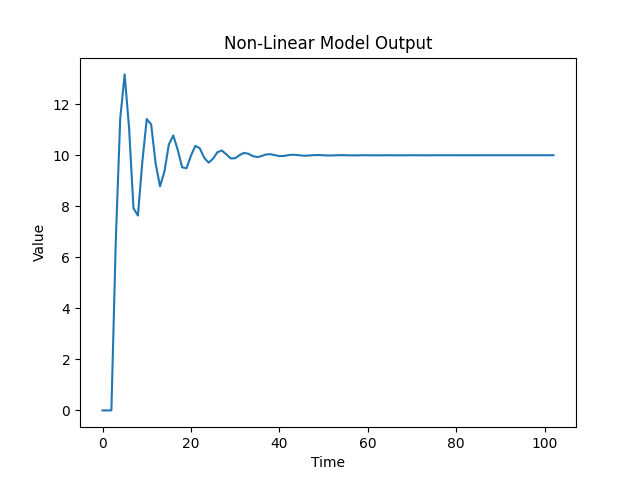

<p align="center"> Министерство образования Республики Беларусь</p>
<p align="center">Учреждение образования</p>
<p align="center">“Брестский Государственный технический университет”</p>
<p align="center">Кафедра ИИТ</p>
<br><br><br><br><br><br><br>
<p align="center">Лабораторная работа №2</p>
<p align="center">По дисциплине “Общая теория интеллектуальных систем”</p>
<p align="center">Тема: “ПИД-регуляторы”</p>
<br><br><br><br><br>
<p align="right">Выполнил:</p>
<p align="right">Студент 2 курса</p>
<p align="right">Группы ИИ-24</p>
<p align="right">Поддубный Ю. А.</p>
<p align="right">Проверил:</p>
<p align="right">Иванюк Д. С.</p>
<br><br><br><br><br>
<p align="center">Брест 2023</p>

---

# Общее задание #
1. Написать отчет по выполненной лабораторной работе №1 в .md формате (readme.md) и с помощью запроса на внесение изменений (**pull request**) разместить его в следующем каталоге: **trunk\ii0xxyy\task_02\doc** (где **xx** - номер группы, **yy** - номер студента, например **ii02102**).
2. Исходный код написанной программы разместить в каталоге: **trunk\ii0xxyy\task_02\src**.

# Задание #
На С++ реализовать программу, моделирующую рассмотренный выше ПИД-регулятор.  В качестве объекта управления использовать математическую модель, полученную в предыдущей работе.
В отчете также привести графики для разных заданий температуры объекта, пояснить полученные результаты.

---
# Код программы: #
```cpp
#include <iostream>
#include <cmath>
#include <vector>
#include <fstream>

class Regulator {
private:
    const double a = 0.722;
    const double b = 0.421;
    const double c = 0.587;
    const double d = 0.035;

    const double k = 0.0001;
    const double t = 100;
    const double td = 100;
    const double t0 = 1;

    const double q0 = k * (1 + td / t0);
    const double q1 = -k * (1 + 2 * td / t0 - t0 / t);
    const double q2 = k * td / t0;

    std::vector<double> q = {q0, q1, q2};
    std::vector<double> e = {0, 0, 0};
    std::vector<double> y = {0, 0, 0};
    std::vector<double> u = {1, 1};
public:
    [[nodiscard]] double sum() const {
        double sum = 0;
        for (int i = 0; i < 3; i++) {
            sum += q[i] * e[i];
        }
        return sum;
    }

    void notLinearModel(int n, double value) {
        for (int i = 0; i < n; i++) {
            e[0] = value - y[y.size() - 1];
            e[1] = value - y[y.size() - 2];
            e[2] = value - y[y.size() - 3];

            u[0] = u[1] + sum();
            y.push_back(a * y[y.size() - 1] - b * y[y.size() - 2] * y[y.size() - 2] + c * u[0] + d * sin(u[1]));
            u[1] = u[0];
        }
    }
    std::vector<double> getParameterY() {
        return  y;
    }
};

int main() {
    double value;
    std::ofstream out("output.txt");
    Regulator model1;
    if (out.is_open()) {
        std::cout << "Enter the value: ";
        std::cin >> value;
        model1.notLinearModel(100, value);
        std::vector<double> y_val = model1.getParameterY();

        for (int i = 0; i < y_val.size(); i++) {
            double resValue = y_val[i] * value / y_val[y_val.size() - 1];
            std::cout << i << " " << resValue << std::endl;
            out << i << " " << value << std::endl;
        }

        out.close();
    } else {
        std::cerr << "Error: Cannot open the output file." << std::endl;
    }
    return 0;
}
    
```

Вывод:
```
0 0      
1 0      
2 0      
3 6.66725
4 11.4415
5 13.1679
6 11.067 
7 7.91978
8 7.6364 
9 9.74134
10 11.4181
11 11.2068
12 9.6845
13 8.77962
14 9.36102
15 10.4223
16 10.775
17 10.2164
18 9.52766
19 9.4879
20 9.98477
21 10.3697
22 10.2716
23 9.89869
24 9.71007
25 9.86571
26 10.12
27 10.1845
28 10.0343
29 9.87628
30 9.88057
31 10.0052
32 10.0913
33 10.0571
34 9.96597
35 9.92734
36 9.97026
37 10.0307
38 10.0411
39 10.0018
40 9.96576
41 9.9704
42 10.0016
43 10.0204
44 10.0099
45 9.98784
46 9.98027
47 9.99195
48 10.0062
49 10.0075
50 9.9974
51 9.98929
52 9.99132
53 9.99909
54 10.0031
55 10.0001
56 9.99486
57 9.99351
58 9.99666
59 10
60 10
61 9.99753
62 9.99577
63 9.99651
64 9.99846
65 9.99934
66 9.99853
67 9.99732
68 9.99715
69 9.99801
70 9.99883
71 9.9988
72 9.99821
73 9.99787
74 9.99814
75 9.99866
76 9.99888
77 9.9987
78 9.99846
79 9.99848
80 9.99875
81 9.99898
82 9.999
83 9.99889
84 9.99886
85 9.99898
86 9.99915
87 9.99924
88 9.99923
89 9.99922
90 9.99927
91 9.99938
92 9.99948
93 9.99952
94 9.99954
95 9.99957
96 9.99965
97 9.99973
98 9.99979
99 9.99983
100 9.99987
101 9.99993
102 10
```


