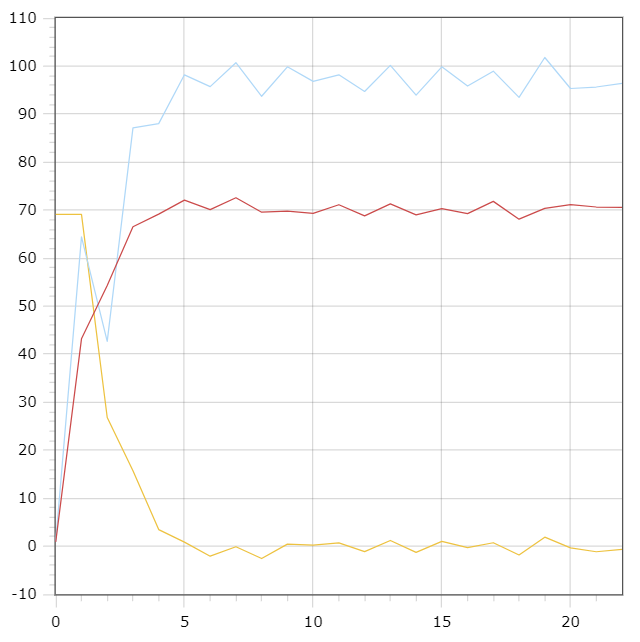

<p align="center"> Министерство образования Республики Беларусь</p>
<p align="center">Учреждение образования</p>
<p align="center">“Брестский Государственный технический университет”</p>
<p align="center">Кафедра ИИТ</p>
<br><br><br><br><br><br><br>
<p align="center">Лабораторная работа №2</p>
<p align="center">По дисциплине “Общая теория интеллектуальных систем”</p>
<p align="center">Тема: “ПИД-регуляторы”</p>
<br><br><br><br><br>
<p align="right">Выполнил:</p>
<p align="right">Студент 2 курса</p>
<p align="right">Группы ИИ-24</p>
<p align="right">Рекун Д. А.</p>
<p align="right">Проверил:</p>
<p align="right">Иванюк Д. С.</p>
<br><br><br><br><br>
<p align="center">Брест 2023</p>

---

# Общее задание #
1. Написать отчет по выполненной лабораторной работе №1 в .md формате (readme.md) и с помощью запроса на внесение изменений (**pull request**) разместить его в следующем каталоге: **trunk\ii0xxyy\task_02\doc** (где **xx** - номер группы, **yy** - номер студента, например **ii02102**).
2. Исходный код написанной программы разместить в каталоге: **trunk\ii0xxyy\task_02\src**.

# Задание #
На С++ реализовать программу, моделирующую рассмотренный выше ПИД-регулятор.  В качестве объекта управления использовать математическую модель, полученную в предыдущей работе.
В отчете также привести графики для разных заданий температуры объекта, пояснить полученные результаты.

---
# Код программы: #
```cpp
#include <iostream>
#include <vector>

class PIDController {
private:
    float a, b, c, d, e, f0, fD, g, u, u1, w;
    float q0, q1, q2;
    std::vector<float> Yt; //выходная переменная
    std::vector<float> E;  //ошибка

public:
    PIDController(float start, float target)
        : a(0.5), b(0.6), c(0.6), d(0.4), e(0.9), f0(1.2), fD(1.1), g(1.1), u(1.0), u1(1.0), w(target)
    {
        Yt.push_back(start); 
        Yt.push_back(start);
        E.push_back(w - start); 
        E.push_back(w - start);
    }

    void calculate()
    {
        // Коэффициенты
        q0 = e * (fD / f0 + 1);
        q1 = -e * (-f0 / g + 1 + 2 * fD / f0);
        q2 = e * (fD / f0);

        // Вычисление значений
        int temp = 2;
        while (std::abs(Yt.back() - w) > 0.1) {//пока ошибка меньше 0.1
            temp++;
            E.push_back(w - Yt.back());
            u = u1 + q0 * E.back() + q1 * E[E.size() - 2] + q2 * E[E.size() - 3]; //алгоритм работы ПИД-регулятора 

            Yt.push_back(a * Yt.back() - b * Yt[Yt.size() - 2] + c * u + d * std::sin(u1));
            u1 = u;
        }
    }

    void printGraph() // Вывод графика
    {
        for (int i = 0; i < Yt.size(); i++) {
            std::cout << Yt[i] << std::endl;
        }
    }
};

int main()
{
    float start = 10.0;
    float target = 60.0;

    PIDController pidController(start, target);
    pidController.calculate();
    pidController.printGraph();

    return 0;
}
    
```

Вывод:
```
10
10
29.3911
48.0654
54.2351
55.5657
58.3342
58.6404
59.0638
60.3983
59.9994
```


