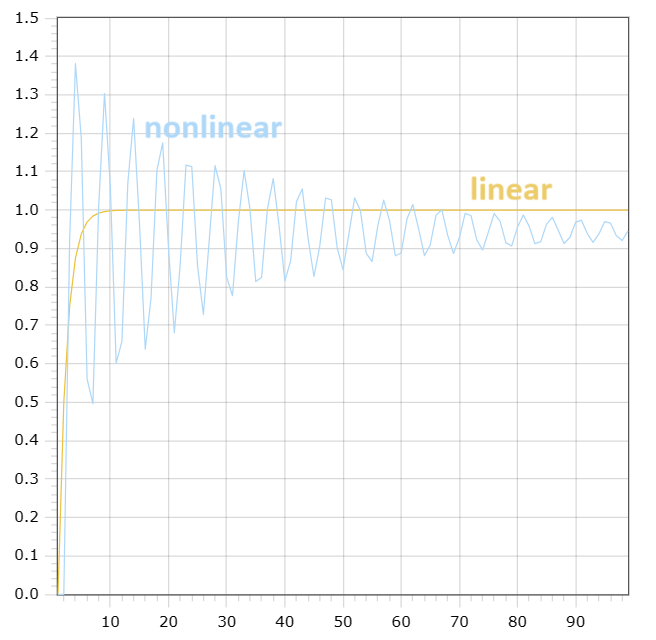

<p align="center"> Министерство образования Республики Беларусь</p>
<p align="center">Учреждение образования</p>
<p align="center">“Брестский Государственный технический университет”</p>
<p align="center">Кафедра ИИТ</p>
<br><br><br><br><br><br><br>
<p align="center">Лабораторная работа №1</p>
<p align="center">По дисциплине “Общая теория интеллектуальных систем”</p>
<p align="center">Тема: “Моделирования температуры объекта”</p>
<br><br><br><br><br>
<p align="right">Выполнил:</p>
<p align="right">Студент 2 курса</p>
<p align="right">Группы ИИ-24</p>
<p align="right">Рудецкий Е. В.</p>
<p align="right">Проверил:</p>
<p align="right">Иванюк Д. С.</p>
<br><br><br><br><br>
<p align="center">Брест 2023</p>

---

# Общее задание #
1. Написать отчет по выполненной лабораторной работе №1 в .md формате (readme.md) и с помощью запроса на внесение изменений (**pull request**) разместить его в следующем каталоге: **trunk\ii0xxyy\task_01\doc** (где **xx** - номер группы, **yy** - номер студента, например **ii02102**).
2. Исходный код написанной программы разместить в каталоге: **trunk\ii0xxyy\task_01\src**.

## Task 1. Modeling controlled object ##
Let's get some object to be controlled. We want to control its temperature, which can be described by this differential equation:

$$\Large\frac{dy(\tau)}{d\tau}=\frac{u(\tau)}{C}+\frac{Y_0-y(\tau)}{RC} $$ (1)

where $\tau$ – time; $y(\tau)$ – input temperature; $u(\tau)$ – input warm; $Y_0$ – room temperature; $C,RC$ – some constants.

After transformation we get these linear (2) and nonlinear (3) models:

$$\Large y_{\tau+1}=ay_{\tau}+bu_{\tau}$$ (2)
$$\Large y_{\tau+1}=ay_{\tau}-by_{\tau-1}^2+cu_{\tau}+d\sin(u_{\tau-1})$$ (3)

where $\tau$ – time discrete moments ($1,2,3{\dots}n$); $a,b,c,d$ – some constants.

Task is to write program (**С++**), which simulates this object temperature.

---

# Выполнение задания #

Код программы:
```C++
  #include<iostream>
#include<vector>
#include<cmath>
using namespace std;

int t=50;
float a1=0.75,b1=0.87,a2=-0.1,b2=0.45,c2=0.64,d2=-0.5,u=1.95,u2=3.5;
vector<float>y(t),y2(t);

void linfunc(float a, float b, int i)
{
   if(i<=0)
      y[i]=0;
   else
      y[i]=a*y[i-1]+b*u;
}

void unlinfunc(float a, float b, float c, float d, int i)
{
   if(i<=0)
      y2[i]=0;
   else
      y2[i]=a*y2[i-1]-b*powf(y2[i-2],2)+c*u2+d*sin(u2);
}

int main() {
   
   for(int i=0;i<t;i++)
   {
      linfunc(a1,b1,i);
   }
   
   for(int i=0;i<t;i++)
   {
      unlinfunc(a2,b2,c2,d2,i);
   }
   
   cout<<"linear:\n";
   for(int i = 0; i < t; i++){
      cout<<y[i]<<endl;
   }
   cout<<"----------------------\nunlinear:\n";
   for(int i = 0; i < t; i++){
      cout<<y2[i]<<endl;
   }
   cout<<endl;
   return 0;
}
```     

Вывод программы:

    linear:
    0
    1.6965
    2.96888
    3.92316
    4.63887
    5.17565
    5.57824
    5.88018
    6.10663
    6.27648
    6.40386
    6.49939
    6.57104
    6.62478
    6.66509
    6.69532
    6.71799
    6.73499
    6.74774
    6.75731
    6.76448
    6.76986
    6.77389
    6.77692
    6.77919
    6.78089
    6.78217
    6.78313
    6.78384
    6.78438
    6.78479
    6.78509
    6.78532
    6.78549
    6.78562
    6.78571
    6.78578
    6.78584
    6.78588
    6.78591
    6.78593
    6.78595
    6.78596
    6.78597
    6.78598
    6.78598
    6.78599
    6.78599
    6.78599
    6.78599
    ----------------------
    unlinear:
    0
    2.41539
    2.17385
    -0.427346
    0.331591
    2.30005
    2.13591
    -0.178806
    0.380326
    2.36297
    2.114
    -0.308645
    0.435202
    2.329
    2.09726
    -0.23525
    0.459591
    2.34453
    2.08589
    -0.266763
    0.48415
    2.33495
    2.07642
    -0.245654
    0.499781
    2.33826
    2.06916
    -0.251877
    0.513931
    2.33545
    2.06299
    -0.245354
    0.524759
    2.33583
    2.05789
    -0.245636
    0.534242
    2.33482
    2.05347
    -0.24307
    0.54216
    2.33459
    2.04966
    -0.24221
    0.549113
    2.33408
    2.0463
    -0.240808
    0.555173
    2.33378

