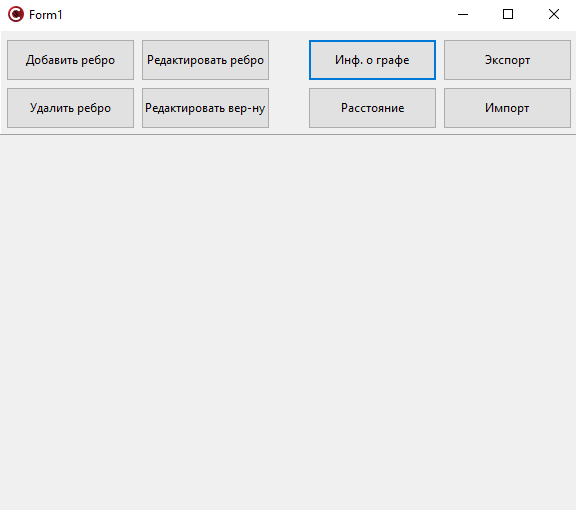

Министерство образования Республики Беларусь

Учреждение образования

"Брестский Государственный технический университет"

Кафедра ИИТ

 
 

Лабораторная работа №3

По дисциплине: "Общая теория интеллектуальных систем"

Тема: "Разработка редакторов графов"

 
 

Выполнил: Студент 2 курса Группы ИИ-24 Рудецкий Е.В.

Проверил: Иванюк Д. С.

 

Брест 2023

---

# Общее задание #
1. Разработать и реализовать программный продукт, позволяющий
редактировать графовые конструкции различных видов и производить над
ними различные действия. Язык программирования - **C++**.

2. В редакторе реализовано:
  a) одновременно работать с несколькими графами (MDI);
  d) сохранять и восстанавливать граф во внутреннем формате программы;
  e) экспортировать и импортировать граф в текстовый формат (описание
см. ниже);
  f) создавать, удалять, именовать, переименовывать;
  g) создавать ориентированные и неориентированные дуги, удалять дуги;
  i) задавать цвет дуги и узла, образ узла;

3. Программный продукт возможны следующие операции:
  a) выводить информацию о графе:
 + количество вершин, дуг;
 + степени для всех вершин и для выбранной вершины;
 + матрицу инцидентности;
 + матрицу смежности;
 + является ли он деревом, полным, связанным, эйлеровым;

  c) вычисление расстояния между двумя узлами;

 + бинарное и обычное дерево;
 + полный граф;
 + планарный граф;
 + связанный граф;

4. Написать отчет по выполненной лабораторной работе в .md формате (readme.md). Разместить его в следующем каталоге: **trunk\ii0xxyy\task_03\doc** (где **xx** - номер группы, **yy** - номер студента, например **ii02102**).

5. Исходный код разработанной программы разместить в каталоге: **trunk\ii0xxyy\task_03\src**.

6. Отразить выполнение работы в файле readme.md в соответствующей строке (например, для студента под порядковым номером 1 - https://github.com/brstu/OTIS-2023/edit/main/readme.md?#L17-L17).

# Выполнение задания #

ЛКМ - добавить вершину
ПКМ - удалить вершину

Добавить ребро (щелкните по вершине)

Удалить ребро (щелкните по ребру)

Редактировать ребро (щелкните по ребру)

