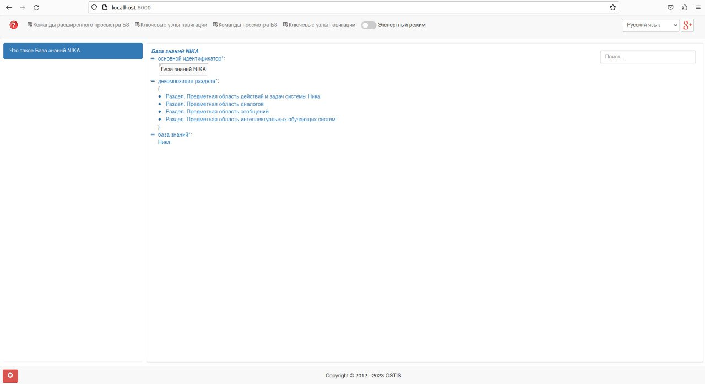
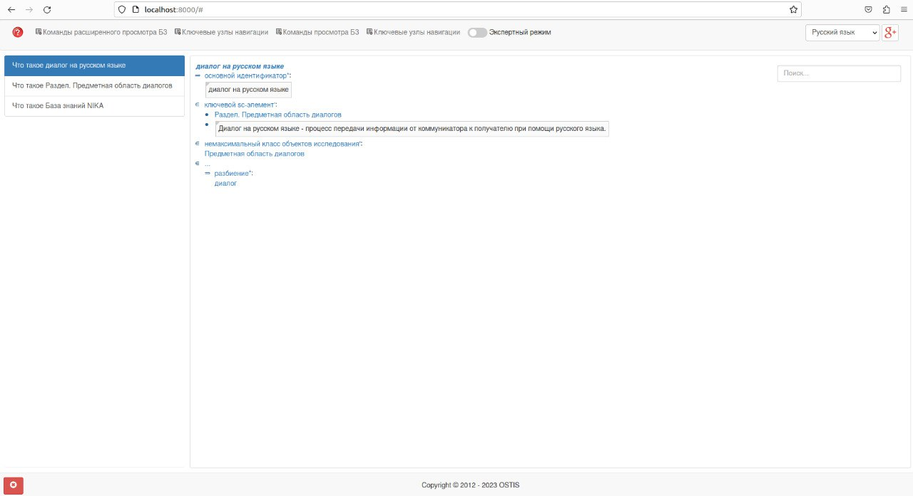
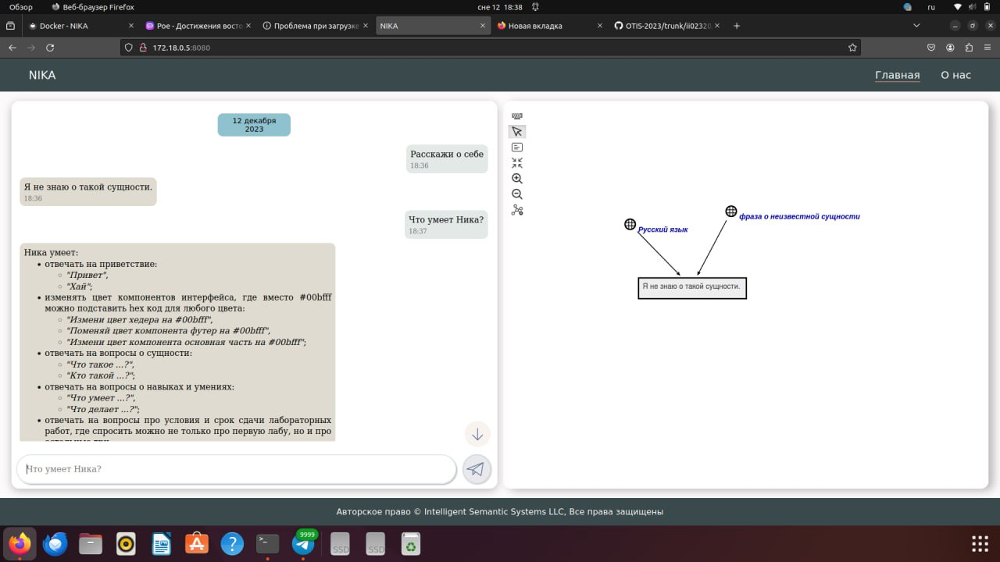
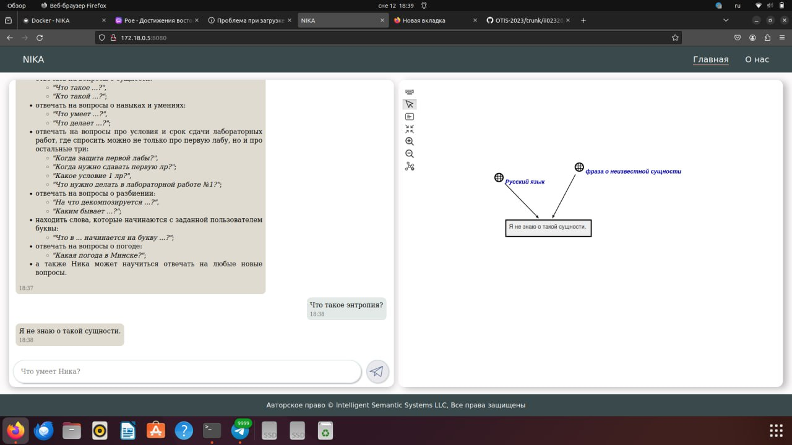
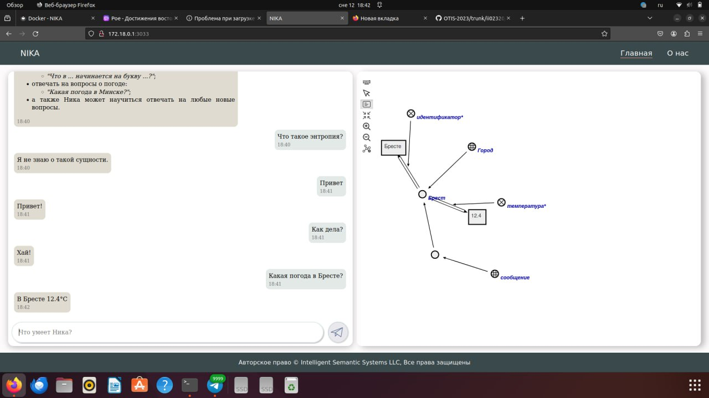

<p align="center"> Министерство образования Республики Беларусь</p>
<p align="center">Учреждение образования</p>
<p align="center">“Брестский Государственный технический университет”</p>
<p align="center">Кафедра ИИТ</p>
<br><br><br><br><br><br><br>
<p align="center">Лабораторная работа №4</p>
<p align="center">По дисциплине “Общая теория интеллектуальных систем”</p>
<p align="center">Тема: “Работа с проектом "NIKA" (Intelligent Knowledge-driven Assistant)”</p>
<br><br><br><br><br>
<p align="right">Выполнил:</p>
<p align="right">Студент 2 курса</p>
<p align="right">Группы ИИ-24</p>
<p align="right">Супрунович И. С.</p>
<p align="right">Проверил:</p>
<p align="right">Иванюк Д. С.</p>
<br><br><br><br><br>
<p align="center">Брест 2023</p>

---

# Общее задание #
1. Изучить руководство.

2. Запустить данный проект на локальной машине (домашний персональный компьютер, ноутбук, рабочая машина в аудитории и т.п.). Продемонстрировать работу проекта преподавателю.

3. Написать отчет по выполненной работе в .md формате (readme.md) и с помощью pull request разместить его в следующем каталоге: trunk\ii0xxyy\task_04\doc.


---

# Выполнение задания #

Установил Docker и проект NIKA по руководству, затем запустил его. Задал NIKA несколько вопросов в диалоговом окне. Приобрел опыт работы с этим проектом, а также с Docker-ом. Вот несколько скриншотов, в которых видна работа с этим проектом.

Установка Docker
```
Обновил список пакетов:
sudo apt-get update
Выполнил обновление пакетов:
sudo apt-get upgrade -y
Удалил возможно оставшиеся зависимости пакетов:
sudo apt autoremove -y
Установил необходимые пакеты и зависимости:
sudo apt-get install -y python3-pip python-dev libffi-dev libssl-dev gcc libc-dev make curl openssl-dev rust cargo make
Установил Docker с помощью скрипта:
curl -fsSL get.docker.com | sudo sh
Добавил себя в группу Docker, чтобы использовать Docker без использования sudo:
sudo usermod -aG docker $USER
Проверил установленную версию Docker:
dpkg -l | grep -i docker

Устанока NIKA
```

Для начала установки выполните следующие шаги:

Склонируйте репозиторий NIKA с помощью команды:
git clone -c core.longpaths=true -c core.autocrlf=true https://github.com/ostis-apps/nika 
Перейдите в каталог проекта:
cd nika
Обновите подмодули репозитория:
git submodule update --init --recursive
Выполните команду для загрузки необходимых образов Docker:
docker compose pull
После успешного завершения установки, можно приступить к сборке и запуску NIKA:

Соберите контейнеры Docker с помощью команды:
sudo docker compose build
Запустите NIKA с помощью следующей команды:
sudo docker compose up --no-build
После выполнения этой команды у вас будет доступны два web-интерфейса:

sc-web - доступен по адресу localhost:8000
Диалоговый web-интерфейс - доступен по адресу localhost:3033
Теперь вы можете начать использовать NIKA

sc-веб:




Веб-диалог пользовательского интерфейса: 





