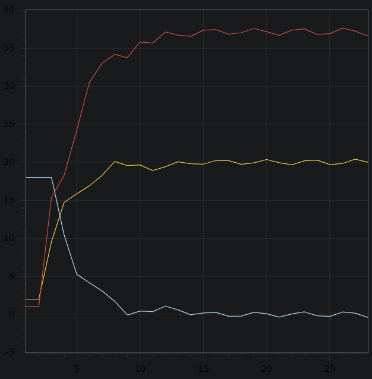

<p align="center"> Министерство образования Республики Беларусь</p>
<p align="center">Учреждение образования</p>
<p align="center">“Брестский Государственный технический университет”</p>
<p align="center">Кафедра ИИТ</p>
<br><br><br><br><br><br><br>
<p align="center">Лабораторная работа №2</p>
<p align="center">По дисциплине “Общая теория интеллектуальных систем”</p>
<p align="center">Тема: “ПИД-регуляторы”</p>
<br><br><br><br><br>
<p align="right">Выполнил:</p>
<p align="right">Студент 2 курса</p>
<p align="right">Группы ИИ-24</p>
<p align="right">Сухаревич Д.С.</p>
<p align="right">Проверил:</p>
<p align="right">Иванюк Д. С.</p>
<br><br><br><br><br>
<p align="center">Брест 2023</p>

---

# Общее задание #
1. Написать отчет по выполненной лабораторной работе №1 в .md формате (readme.md) и с помощью запроса на внесение изменений (**pull request**) разместить его в следующем каталоге: **trunk\ii0xxyy\task_02\doc** (где **xx** - номер группы, **yy** - номер студента, например **ii02302**).
2. Исходный код написанной программы разместить в каталоге: **trunk\ii0xxyy\task_02\src**.

# Задание #
Задание. На C++ реализовать программу, моделирующую рассмотренный выше ПИД-регулятор. В качестве объекта управления использовать математическую модель, полученную в предыдущей работе. В отчете также привести графики для разных заданий температуры объекта, пояснить полученные результаты.
---
# Код программы: #
```C++    
#include <iostream>
#include <vector>
#include <cmath>


int main() {
	
	const double A = 0.5;
	const double B = 0.6;
	const double C = 0.6;
	const double D = 0.6;
	const double K = 0.8;
	const double T0 = 1.14;
	const double TD = 0.99;
	const double T = 1.1;
	const double YS = 2.0;
	const double W = 20;

	double buf = TD / T0;
	double q0 = K * (1 + buf);
	double q1 = -K * (1 + 2 * buf - T0 / T);
	double q2 = K * buf;
	std::vector<double> y = { YS, YS };
	double U = 1.0;
	std::vector<double> E = { W - YS, W - YS };
	std::vector<double> um = { U, U };

	while (std::abs(y.back() - W) > 0.01) {
		E.push_back(W - y.back());
		U = um[um.size()-1] + q0 * E.back() + q1 * E[E.size() - 2] + q2 * E[E.size() - 3];
		y.push_back(A * y.back() - B * y[y.size() - 2] + C * U + D * std::sin(um[um.size() - 1]));
		um.push_back(U);
	}

	for (int i=0; i < y.size(); i++) {
		std::cout << i+1 << ";" << y[i] << ";" << E[i] << ";" << um[i] << std::endl;
	}

	return 0;
}
```
Вывод:
```
1;2;18;1
2;2;18;1
3;9.54488;18;15.4
4;14.7205;10.4551;18.2769
5;15.8424;5.27954;24.2237
6;16.9143;4.15761;30.4979
7;18.2768;3.08572;33.0028
8;20.0918;1.72325;34.1701
9;19.567;-0.0917899;33.7675
10;19.644;0.432959;35.8156
11;18.9085;0.35601;35.6628
12;19.4078;1.09146;37.1268
13;20.0554;0.592205;36.7026
14;19.8095;-0.055358;36.5504
15;19.7358;0.190501;37.3526
16;20.2417;0.264249;37.4388
17;20.2193;-0.241687;36.8239
18;19.7236;-0.219299;37.0327
19;19.9181;0.276374;37.598
20;20.3612;0.0818919;37.1616
21;19.9376;-0.361241;36.6917
22;19.668;0.0624235;37.3721
23;20.1941;0.331975;37.5256
24;20.2676;-0.194062;36.7917
25;19.6886;-0.267637;36.9067
26;19.8347;0.311366;37.6304
27;20.4041;0.165296;37.2353
28;19.9953;-0.404112;36.6041
```

