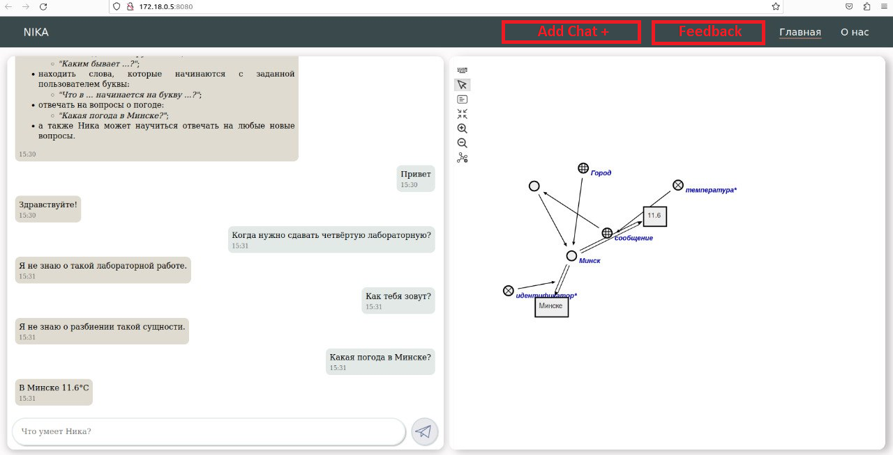

 Министерство образования Республики Беларусь

Учреждение образования

“Брестский Государственный технический университет”

Кафедра ИИТ

       

Лабораторная работа №5

По дисциплине “Общая теория интеллектуальных систем”

Тема: “Работа с проектами”

     

Выполнил:

Студент 2 курса

Группы ИИ-24

Сухаревич Д. С.

Проверил:

Иванюк Д. С.

     

Брест 2023

---
# Общее задание #
1. Изучить следующие открытые проекты:
   1. 1. The OSTIS Technology project;
   2. 2. The OSTIS Applications;

2. Внести свой вклад в проект (в виде оформления вопросов (issues)):
    - предложить исправления в ошибках в документации (синтаксические, орфографические и т.п.);
    - предложить исправления в исходном коде;
    - предложить новую функциональность.
3. Написать отчет по выполненной работе в .md формате (readme.md) и с помощью pull request разместить его в следующем каталоге: trunk\ii0xxyy\task_05\doc.

---

# Выполнение задания #

Можно добавить возможность создавать сразу несколько чатов с NIKA. Добавить кнопку, при нажатии которой будет создаваться новый чат. Также добавить список чатов, чтобы можно было переключатья между чатами. Это поможет структурировать диалог с NIKA. Например в первом чате можно будет вести диалог о работе и просить у NIKA помощь, а во втором интересоваться погодой и сданными лабами. 

Можно добавить возможность связаться со службой поддержки NIKA. Добавить кнопку feedback. Таким образом пользователи смогут отправлять свои вопросы и идеи для улучшения NIKA прямо на почту или контакты службы поддержки.

Можно сделать NIKA мультиплатформенной или реализовать как сайт, чтобы была возможность простой установки или работы без установки.
