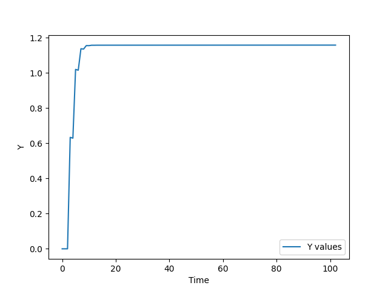

<p align="center">Министерство образования Республики Беларусь</p>
<p align="center">Учреждение образования</p>
<p align="center">"Брестский Государственный технический университет"</p>
<p align="center">Кафедра ИИТ</p>
<br>
<br>
<p align="center">Лабораторная работа №2</p>
<p align="center">По дисциплине: "Общая теория интеллектуальных систем"</p>
<p align="center">Тема: "ПИД-регуляторы"</p>
<br>
<br>
<p align="right">Выполнил:<br>Студент 2 курса<br>Группы ИИ-24<br>Черник В.А.</p>
<p align="right">Проверил:<br>Иванюк Д. С.</p>
<br>
<p align="center">Брест 2023</p>

---

# Общее задание #
1. Написать отчет по выполненной лабораторной работе №2 в .md формате (*readme.md*) и с помощью **pull request** разместить его в следующем каталоге: **trunk\ii0xxyy\task_02\doc**.
2. Исходный код написанной программы разместить в каталоге: **trunk\ii00xxyy\task_02\src**.
---

# Выполнение задания #

Вывод программы:
```
Enter the value: 
4
0 0.0
1 0.0
2 0.0
3 2.188611803954232 
4 2.172614066678949 
5 3.5227633359297945
6 3.5066215378805885
7 3.9283277408515627
8 3.9224396261069585
9 3.9904517742721786
10 3.989343653251702
11 3.997503108085366
12 3.9973511857405195
13 3.9982920226098364
14 3.998286433882263
15 3.9984085028827776
16 3.9984234989693626
17 3.998453376197232
18 3.998471147189886
19 3.9984906506516067
20 3.998508785173564
21 3.998527121091371
22 3.9985453021123902
23 3.9985635064395924
24 3.998581693155059
25 3.9985998824826927
26 3.9986180697248006
27 3.998636257176698
28 3.998654444299216
29 3.9986726313528784
30 3.9986908182758225
31 3.998709005097621
32 3.9987271918111778
33 3.9987453784198537
34 3.998763564922834
35 3.998781751320502
36 3.9987999376127656
37 3.9988181237996687
38 3.998836309881203
39 3.998854495857374
40 3.9988726817281814
41 3.998890867493628
42 3.9989090531537146
43 3.9989272387084425
44 3.998945424157813
45 3.998963609501827
46 3.998981794740487
47 3.998999979873794
48 3.999018164901748
49 3.999036349824353
50 3.999054534641606
51 3.999072719353514
52 3.999090903960073
53 3.999109088461287
54 3.999127272857158
55 3.9991454571476854
56 3.9991636413328706
57 3.999181825412715
58 3.999200009387223
59 3.9992181932563917
60 3.9992363770202246
61 3.9992545606787226
62 3.9992727442318876
63 3.999290927679719
64 3.9993091110222214
65 3.999327294259392
66 3.9993454773912354
67 3.9993636604177505
68 3.999381843338942
69 3.9994000261548064
70 3.9994182088653503
71 3.99943639147057
72 3.9994545739704708
73 3.9994727563650523
74 3.9994909386543163
75 3.9995091208382645
76 3.9995273029168956
77 3.9995454848902128
78 3.999563666758219
79 3.9995818485209127
80 3.9996000301782964
81 3.999618211730373
82 3.999636393177141
83 3.9996545745186025
84 3.999672755754761
85 3.9996909368856137
86 3.9997091179111672
87 3.999727298831419
88 3.9997454796463714
89 3.999763660356025
90 3.9997818409603827
91 3.999800021459445
92 3.9998182018532122
93 3.9998363821416887
94 3.9998545623248716
95 3.999872742402765
96 3.9998909223753687
97 3.999909102242685
98 3.9999272820047156
99 3.999945461661461
100 3.9999636412129225
101 3.999981820659102
102 4.0
```

