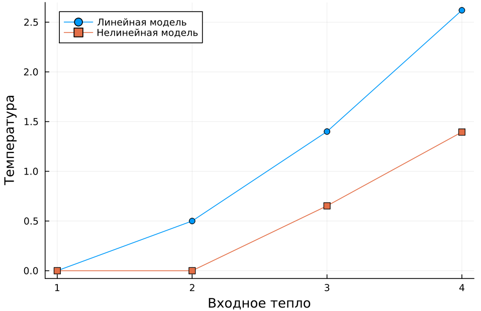

<p style="text-align: center;">Министерство образования Республики Беларусь</p>
<p style="text-align: center;">Учреждение образования</p>
<p style="text-align: center;">“Брестский Государственный технический университет”</p>
<p style="text-align: center;">Кафедра ИИТ</p>
<div style="margin-bottom: 10em;"></div>
<p style="text-align: center;">Лабораторная работа №1</p>
<p style="text-align: center;">По дисциплине “Общая теория интеллектуальных систем”</p>
<p style="text-align: center;">Тема: “Моделирования температуры объекта”</p>
<div style="margin-bottom: 10em;"></div>
<p style="text-align: right;">Выполнил:</p>
<p style="text-align: right;">Студент 2 курса</p>
<p style="text-align: right;">Группы ИИ-24</p>
<p style="text-align: right;">Якимовец Е.Г.</p>
<p style="text-align: right;">Проверил:</p>
<p style="text-align: right;">Иванюк Д. С.</p>
<div style="margin-bottom: 10em;"></div>
<p style="text-align: center;">Брест 2023</p>

---

# Общее задание

1. Написать отчет по выполненной лабораторной работе №1 в .md формате (readme.md) и с помощью запроса на внесение изменений (**pull request**) разместить его в следующем каталоге: trunk\ii0xxyy\task_01\doc (где xx - номер группы, yy - номер студента, например **ii02302**).
2. Исходный код написанной программы разместить в каталоге: **trunk\ii0xxyy\task_01\src**.

## Task 1. Modeling controlled object

Let's get some object to be controlled. We want to control its temperature, which can be described by this differential equation:

$$\Large\frac{dy(\tau)}{d\tau}=\frac{u(\tau)}{C}+\frac{Y_0-y(\tau)}{RC} $$ (1)

where $\tau$ – time; $y(\tau)$ – input temperature; $u(\tau)$ – input warm; $Y_0$ – room temperature; $C,RC$ – some constants.

After transformation we get these linear (2) and nonlinear (3) models:

$$\Large y_{\tau+1}=ay_{\tau}+bu_{\tau}$$ (2)
$$\Large y_{\tau+1}=ay_{\tau}-by_{\tau-1}^2+cu_{\tau}+d\sin(u_{\tau-1})$$ (3)

where $\tau$ – time discrete moments ($1,2,3{\dots}n$); $a,b,c,d$ – some constants.

Task is to write program (**C++**), which simulates this object temperature.

---

# Выполнение задания

Код программы:

```C++
#include <iostream>
#include <cmath>
using namespace std;

class ModelParameters
{
public:
    const double a = 0.3;
    const double b = 0.47;
    const double c = 0.13;
    const double d = 0.47;
    const double u = 1.1;
    double y = 0.1;
    friend double linear_model(int t, int n);
    friend double unlinear_model(int t);
};

ModelParameters params;

double linear_model(int t, int n)
{
    if (n < t)
    {
        double result = params.a * params.y + params.b * params.u;
        params.y = result;
        cout << params.y << endl;
        return linear_model(t, n + 1);
    }
    return params.y;
}

double unlinear_model(int t)
{
    int i = 1;
    while (i <= t)
    {
        double y_prev = params.y;
        double u_prev = params.u;
        double result = params.a * params.y - params.b * pow(y_prev, 2) + params.c * params.u + params.d * sin(u_prev);
        params.y = result;
        cout << params.y << endl;
        i++;
    }
    return params.y;
}

int main()
{
    cout << "Linear model" << endl;
    linear_model(10, 0);
    cout << "\n----------------\n" << endl;
    cout << "Nonlinear model" << endl;
    unlinear_model(10);
    return 0;
}


    Вывод:
Linel model
0.547
0.6811
0.72133
0.733399
0.73702
0.738106
0.738432
0.73853
0.738559
0.738568
0.738568

---------------

Unlinel model
0.527061
0.589423
0.575407
0.578876
0.578035
0.57824
0.57819
0.578202
0.578199
0.5782
0.5782
```

график :


