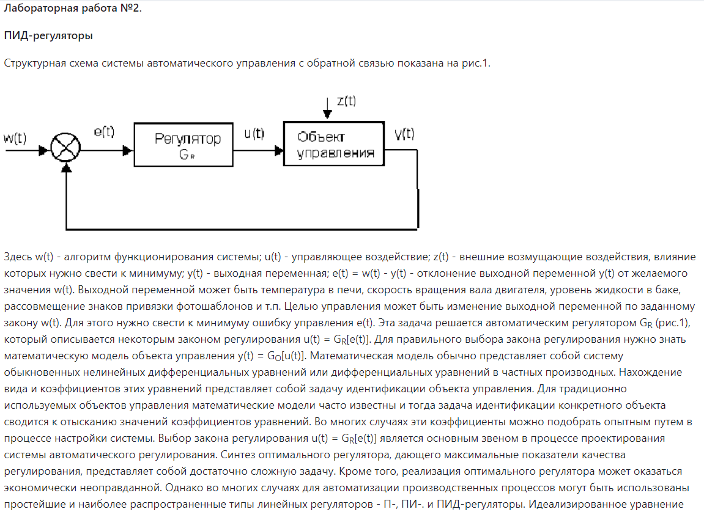

<p align="center"> Министерство образования Республики Беларусь</p>
<p align="center">Учреждение образования</p>
<p align="center">“Брестский Государственный технический университет”</p>
<p align="center">Кафедра ИИТ</p>
<br><br><br><br><br><br><br>
<p align="center">Лабораторная работа №2</p>
<p align="center">По дисциплине “Общая теория интеллектуальных систем”</p>
<p align="center">Тема: “ПИД-регуляторы”</p>
<br><br><br><br><br>
<p align="right">Выполнил:</p>
<p align="right">Студент 2 курса</p>
<p align="right">Группы ИИ-24</p>
<p align="right">Якимовец Е. Г.</p>
<p align="right">Проверил:</p>
<p align="right">Иванюк Д. С.</p>
<br><br><br><br><br>
<p align="center">Брест 2023</p>

---

# Общее задание

1. Написать отчет по выполненной лабораторной работе №2 в .md формате (readme.md) и с помощью запроса на внесение изменений (**pull request**) разместить его в следующем каталоге: **trunk\ii0xxyy\task_02\doc** (где **xx** - номер группы, **yy** - номер студента, например **ii02102**).
2. Исходный код написанной программы разместить в каталоге: **trunk\ii02408\task_02\src**.

{: width="800px" height="900px"}
{: width="800px" height="700px"}
{: width="800px" height="00px"}
{: width="800px" height="900px"}

```c++
#include <iostream>
#include <vector>
#include <cmath>
using namespace std;

class ModelParameters {
public:
    double A = 0.5;
    double B = 0.5;
    double C = 0.5;
    double D = 0.5;
    double K = 1;
    double T0 = 1;
    double TD = 1;
    double T = 1;
    double q1 = K * (TD / T0 + 1);
    double q2 = -K * (-T0 / T + 1 + 2 * TD / T0);
    double q3 = K * (TD / T0);
};

class ControlSystem {
public:
    ControlSystem(const ModelParameters &params) : parameters(params), start_temperature(0.0) {}

    void run() {
        cout << "Enter start temperature: ";
        cin >> start_temperature;
        temperature.push_back(start_temperature);
        error.push_back(desired_temperature - start_temperature);
        double u_k_minus_1 = 0.0;
        cout << "Enter desired temperature: ";
        cin >> desired_temperature;
        cout << "Current temperature: " << temperature.back() << endl;
        int iterations = 0;
        while (abs(desired_temperature - temperature.at(temperature.size() - 1)) > tolerance && iterations < max_iterations) {
            error.push_back(desired_temperature - temperature.at(temperature.size() - 1));
            temperature.push_back(parameters.A * temperature.at(temperature.size() - 1) - parameters.B * temperature.at(temperature.size() - 2) + parameters.C + parameters.D * sin(u_k_minus_1));
            cout << "Current temperature: " << temperature.back() << endl;
            iterations++;
        }
        if (iterations >= max_iterations) {
            cout << "Maximum number of iterations reached. Consider adjusting the parameters." << endl;
        } else {
            cout << "Temperature reached the desired value within tolerance." << endl;
        }
    }

private:
    const ModelParameters &parameters;
    double start_temperature = 0.0; // Инициализация переменной здесь
    double desired_temperature = 0.0;
    vector<double> temperature;
    vector<double> error;
    const double tolerance = 0.1;
    const int max_iterations = 1000;
};

int main() {
    ModelParameters params;
    ControlSystem control_system(params);
    control_system.run();
    return 0;
}


```

Результат:

Enter start temperature: 10
Enter desired temperature: 20
Current temperature: 10
Current temperature: 5
Current temperature: 12.228
Current temperature: 15.892
Current temperature: 18.6399
Current temperature: 19.607
Current temperature: 18.9144
Current temperature: 19.8429
Current temperature: 20.1461
Current temperature: 20.3391
Current temperature: 20.1892
Current temperature: 20.0994
