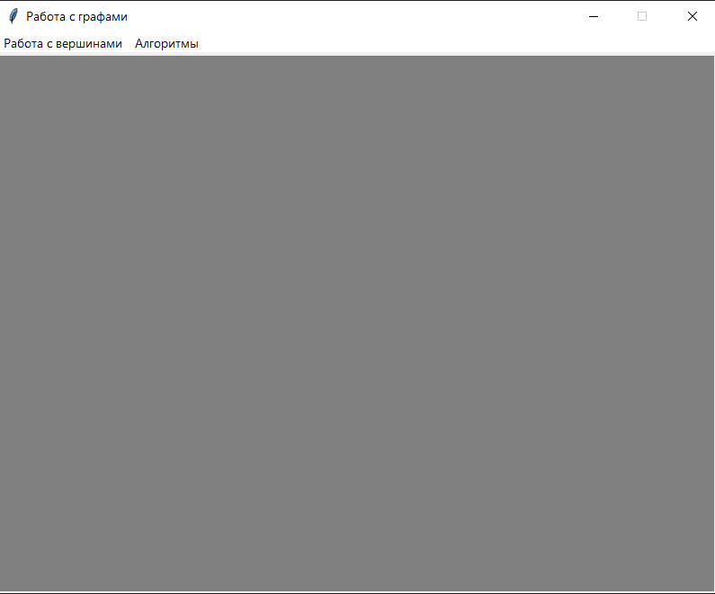
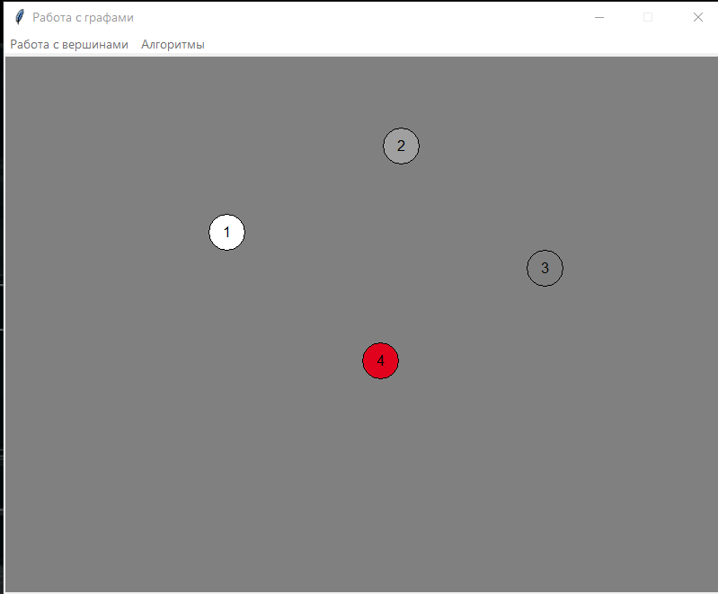
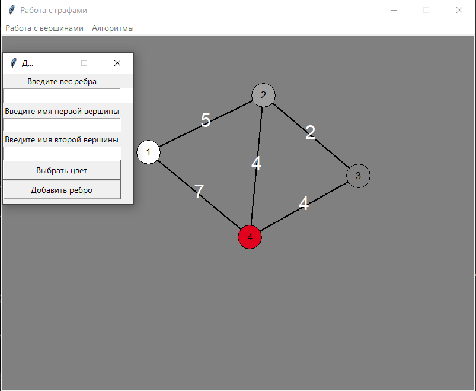
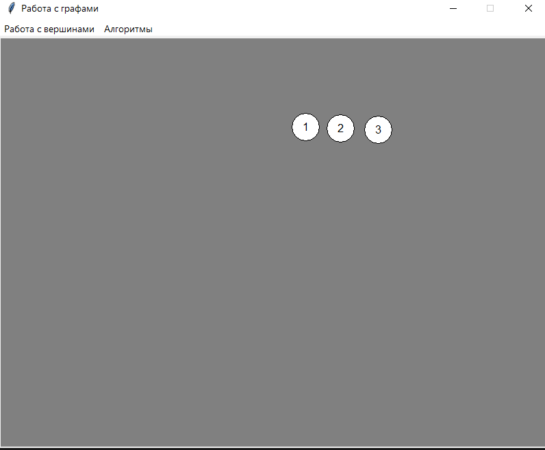
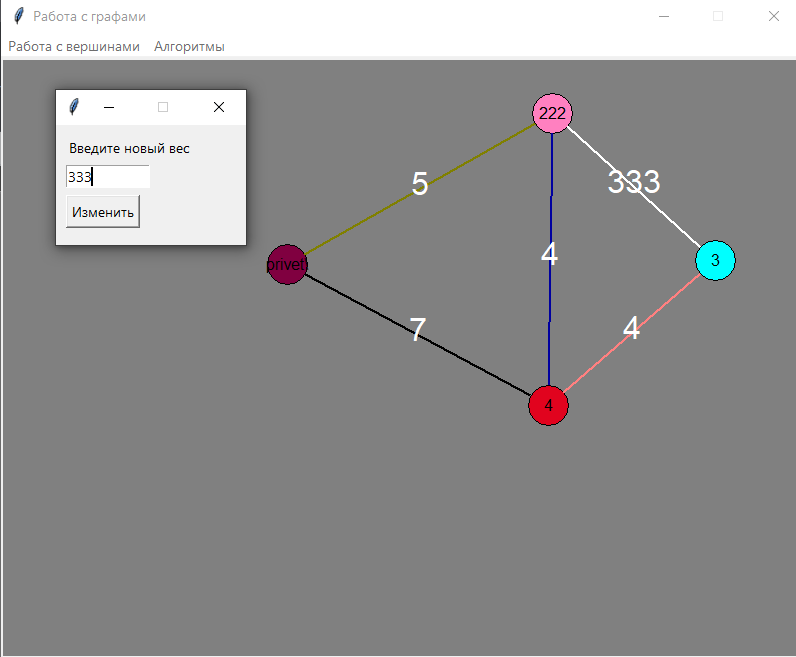
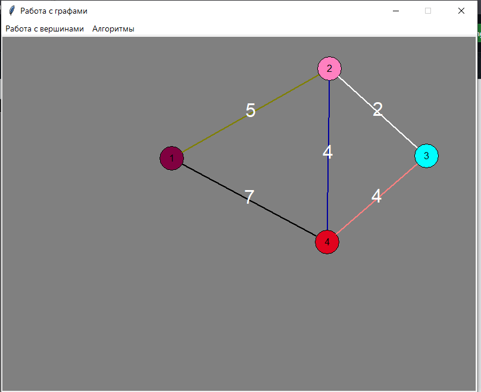
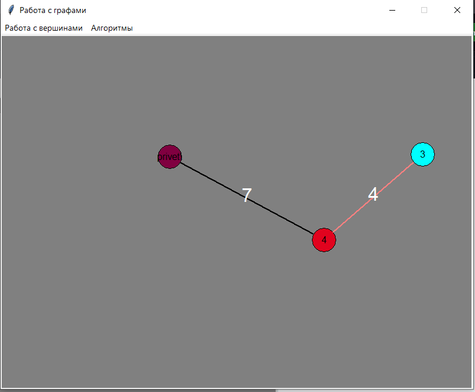
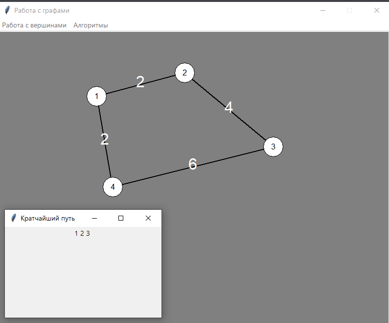
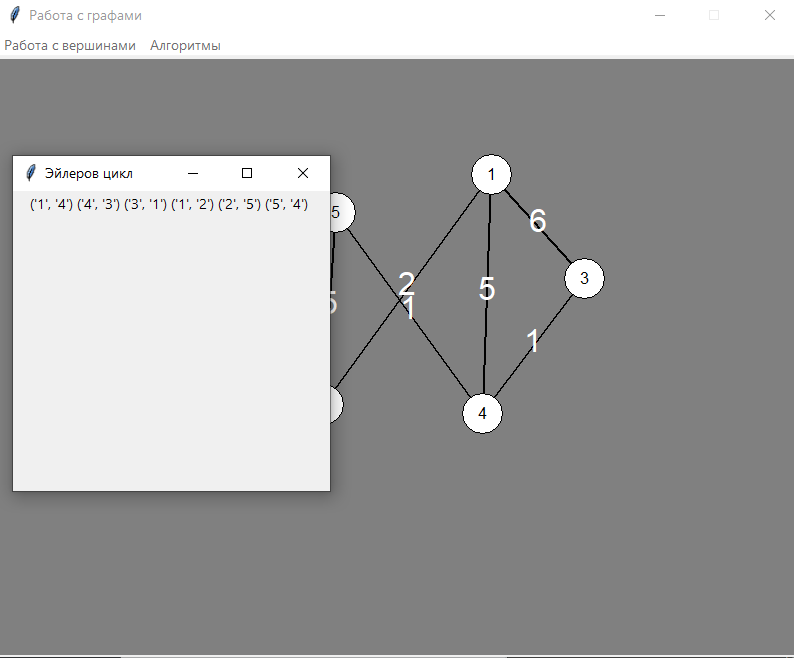

Министерство образования Республики Беларусь

Учреждение образования

"Брестский Государственный технический университет"

Кафедра ИИТ

       

Лабораторная работа №3

По дисциплине "Общая теория интеллектуальных систем"

Тема: «Разработка редакторов графов»

     

Выполнил:

Студент 2 курса

Группы ИИ-24

Якимовец Е.Г.

Проверил:

Иванюк Д. С.

     

Брест 2023

---

# Задание
1. Разработать и реализовать программный продукт позволяющий
редактировать графовые конструкции различных видов и производить над
ними различные действия. Язык программирования - любой.

2. Редактор должен позволять (задания со **[\*]** являются необязательными):  
  a) одновременно работать с несколькими графами (MDI);  
  b) **[\*]** выделение одновременно нескольких элементов графа, копирование
выделенного фрагмента в clipboard и восстановление из него;  
  c) задавать имена графам;  
  d) сохранять и восстанавливать граф во внутреннем формате программы;  
  e) экспортировать и импортировать граф в текстовый формат (описание
см. ниже);  
  f) создавать, удалять, именовать, переименовывать, перемещать узлы;  
  g) создавать ориентированные и неориентированные дуги, удалять дуги;  
  h) добавлять, удалять и редактировать содержимое узла (содержимое в
виде текста и ссылки на файл);  
  i) задавать цвет дуги и узла, образ узла;  
  j) **[\*]** создавать и отображать петли;  
  k) **[\*]** создавать и отображать кратные дуги.

3. Программный продукт должен позволять выполнять следующие операции:  
  a) выводить информацию о графе:

 + количество вершин, дуг;
 + степени для всех вершин и для выбранной вершины;
 + матрицу инцидентности;
 + матрицу смежности;
 + является ли он деревом, полным, связанным, эйлеровым, **[\*]** планарным;

  b) поиск всех путей (маршрутов) между двумя узлами и кратчайших;  
  c) вычисление расстояния между двумя узлами;  
  d) вычисление диаметра, радиуса, центра графа;  
  e) **[\*]** вычисление векторного и декартово произведения двух графов;  
  f) **[\*]** раскраска графа;  
  g) нахождения эйлеровых, [*] гамильтоновых циклов;  
  h) **[\*]** поиск подграфа в графе, со всеми или некоторыми неизвестными
узлами;  
  i) **[\*]** поиск узла по содержимому;  
  j) **[\*]** объединение, пересечение, сочетание и дополнение графов;  
  k) **[\*]** приведение произвольного графа к определенному типу с
минимальными изменениями:

 + бинарное и обычное дерево;
 + полный граф;
 + планарный граф;
 + связанный граф;

4. Формат текстового представления графа:
<ГРАФ> ::= <ИМЯ ГРАФА> : UNORIENT | ORIENT ; <ОПИСАНИЕ УЗЛОВ> ;
<ОПИСАНИЕ СВЯЗЕЙ> .
<ИМЯ ГРАФА> ::= <ИДЕНТИФИКАТОР>
<ОПИСАНИЕ УЗЛОВ> ::= <ИМЯ УЗЛА> [ , <ИМЯ УЗЛА> …]
<ИМЯ УЗЛА> ::= <ИДЕНТИФИКАТОР>
<ОПИСАНИЕ СВЯЗЕЙ> ::= <ИМЯ УЗЛА> -> <ИМЯ УЗЛА> [ , <ИМЯ УЗЛА> …] ;
[<ОПИСАНИЕ СВЯЗЕЙ> …]

5. Написать отчет по выполненной лабораторной работе в .md формате (readme.md). Разместить его в следующем каталоге: **trunk\ii0xxyy\task_03\doc** (где **xx** - номер группы, **yy** - номер студента, например **ii02102**). 

6. Исходный код разработанной программы разместить в каталоге: **trunk\ii0xxyy\task_03\src**.
---
# Описание работы программы: #

# Код программы: #

#подключение библиотек
from tkinter import messagebox,Canvas, Label, Entry, Button, Tk, Menu
from tkinter.colorchooser import askcolor
from numpy.random import randint
from numpy import sqrt
import networkx as nx
def line_intersect_circle(x1, y1, x2, y2):
    '''Returns the coordinates of the intersection points of a line and two circles'''
    main_gipotenusa = sqrt((x2 - x1) ** 2 + (y2 - y1) ** 2)
    main_dx = x2 - x1
    main_dy = y2 - y1
    dx = (main_gipotenusa - 20) * main_dx / main_gipotenusa
    dy = (main_gipotenusa - 20) * main_dy / main_gipotenusa
    return x2 - dx, y2 - dy, x1 + dx, y1 + dy
#класс создания вершин
class Node:
    def __init__(self, name):
        self.name = name
        self.x = randint(0, 636)
        self.y = randint(0, 596)

        self.circle = create_circle(self.x, self.y, 20, fill=color_vertex)
        self.text = canvas.create_text(self.x, self.y, anchor='center', text=name, font="Arial 10", fill="black")
        graph.add_node(name)
    def move(self, x, y):
        self.x = x
        self.y = y
        canvas.coords(self.circle, x-20, y-20, x+20, y+20)
        canvas.coords(self.text, x, y)
        for edge in edges:
            if edge.node1 == self or edge.node2 == self:
                edge.move()
    def change(self):
        win = Tk()
        win.title("Изменение имени")
        win.geometry("190x120+1050+250")
        win.wm_attributes('-topmost', 3)
        win.resizable(False, False)
        label = Label(win, text="Введите новое имя")
        label.place(x=10, y=10)
        entry = Entry(win, width=10)
        entry.place(x=10, y=40)
        button = Button(win, text="Изменить", command=lambda: self.change_name(entry.get()))
        button.place(x=10, y=70)
        win.mainloop()
    def change_name(self, name):
        graph._adj[name] = graph._adj.pop(self.name)
        self.name = name
        canvas.itemconfig(self.text, text=name)
    def change_color(self, color):
        canvas.itemconfig(self.circle, fill=color)
    def delete(self):
        canvas.delete(self.circle)
        canvas.delete(self.text)
        for edge in edges:
            if edge.node1 == self or edge.node2 == self:
                edge.delete()
                edges.remove(edge)
        graph.remove_node(self.name)
def create_circle(x, y, r, **kwargs):
    return canvas.create_oval(x-r, y-r, x+r, y+r, **kwargs)
#класс ребер
class Edge:
    def __init__(self, node1, node2, weight: int):
        self.weight = weight
        self.node1 = node1
        self.node2 = node2
        self.line = canvas.create_line(line_intersect_circle(self.node1.x, self.node1.y, self.node2.x, self.node2.y),width=2, fill="black")
        self.text = canvas.create_text((node1.x + node2.x) / 2, (node1.y + node2.y) / 2 - 5, anchor='center',text=self.weight, font="Arial 20", fill="white")
        graph.add_edge(node1.name, node2.name, weight=weight)
    def change(self):
        win = Tk()
        win.title("Изменение веса")
        win.geometry("190x120+1050+250")
        win.wm_attributes('-topmost', 3)
        win.resizable(False, False)
        label = Label(win, text="Введите новый вес")
        label.place(x=10, y=10)
        entry = Entry(win, width=10)
        entry.place(x=10, y=40)
        print(5)
        button = Button(win, text="Изменить", command=lambda: self.change_weight(entry.get()))
        button.place(x=10, y=70)
        win.mainloop()
    def change_weight(self, weight):
        self.weight = int(weight)
        canvas.itemconfig(self.text, text=weight)
        graph.remove_edge(self.node1.name, self.node2.name)
        graph.add_edge(self.node1.name, self.node2.name, weight=self.weight)
    def change_color(self, color):
        canvas.itemconfig(self.line, fill=color)
    def move(self):
        canvas.coords(self.line, line_intersect_circle(self.node1.x, self.node1.y, self.node2.x, self.node2.y))
        canvas.coords(self.text, (self.node1.x + self.node2.x) / 2, (self.node1.y + self.node2.y) / 2 - 5)
    def delete(self):
        canvas.delete(self.line)
        canvas.delete(self.text)
        graph.remove_edge(self.node1.name, self.node2.name)
#рисуем вершину
def create_vertex(entry_name, window):
    name = entry_name.get()
    nodes.append(Node(name))
    window.destroy()
#выбор цвета
def chose_color(color_lable):
    global color_vertex
    rgb, hx= askcolor()
    print(rgb)
    color_vertex = hx
    color_lable.config(bg=color_vertex)
#меню добавления вершин
def menu_add_vertex():
    global color_vertex
    add_window = Tk()
    add_window.title("Добавление вершины")
    add_window.geometry("190x120+1050+250")
    add_window.wm_attributes('-topmost', 3)
    add_window.resizable(False, False)
    label = Label(add_window, text="Введите имя вершины")
    entry_name = Entry(add_window)
    add_button = Button(add_window, text = "Выбрать цвет",command = lambda: chose_color(color_lable))
    color_button = Button(add_window, text = "Добавить вершину",command = lambda: create_vertex(entry_name,add_window))
    color_lable = Label(add_window,width=2,bg = "white")
    label.grid(row=0, column=0, sticky="ew")
    entry_name.grid(row=1, column=0, sticky="ewns")
    add_button.grid(row=2, column=0, sticky="ewns")
    color_button.grid(row=3, column=0, sticky="ewns")
    color_lable.grid(row = 1,column=1)
    add_window.mainloop()
# создание ребра
def create_edge(entry_weight, entry_node1, entry_node2, window):
    try:
        weight = int(entry_weight.get())
    except ValueError:
        messagebox.showerror("Ошибка", "Вес ребра должен быть числом")
    else:
        node1 = entry_node1.get()
        node2 = entry_node2.get()
        for vertex in nodes:
            if vertex.name == node1:
                node1 = vertex
            if vertex.name == node2:
                node2 = vertex
        edges.append(Edge(node1, node2, weight))
        window.destroy()
#меню добавления ребер
def menu_add_edge():
    add_window = Tk()
    add_window.title("Добавление ребра")
    add_window.geometry("220x220+1050+250")
    add_window.wm_attributes('-topmost', 3)
    add_window.resizable(False, False)
    label = Label(add_window, text="Введите вес ребра")
    entry_weight = Entry(add_window)
    label2 = Label(add_window, text="Введите имя первой вершины")
    entry_node1 = Entry(add_window, text="Введите имя первой вершины")
    label3 = Label(add_window, text="Введите имя второй вершины")
    entry_node2 = Entry(add_window, text="Введите имя второй вершины")
    add_button = Button(add_window, text = "Выбрать цвет",command = lambda: chose_color(color_lable))
    color_button = Button(add_window, text="Добавить ребро",command=lambda: create_edge(entry_weight, entry_node1, entry_node2, add_window))
    color_lable = Label(add_window,width=2,bg = "white")
    label.grid(row=0, column=0, sticky="ew")
    entry_weight.grid(row=1, column=0, sticky="ewns")
    label2.grid(row=2, column=0, sticky="ew")
    entry_node1.grid(row=3, column=0, sticky="ewns")
    label3.grid(row=4, column=0, sticky="ew")
    entry_node2.grid(row=5, column=0, sticky="ewns")
    add_button.grid(row=6, column=0, sticky="ewns")
    color_button.grid(row=7, column=0, sticky="ewns")
    color_lable.grid(row = 1,column=1)
    add_window.mainloop()
def move_node(event):
    for node in nodes:
        if node.x - 25 < event.x < node.x + 25 and node.y - 25 < event.y < node.y + 25:
            node.move(event.x, event.y)
            break
def change_name_or_weight(event):
    x, y = event.x, event.y
    for edge in edges:
        print(2)
        legs_sum = sqrt((x - edge.node1.x)**2 + (y - edge.node1.y)**2) + sqrt((x - edge.node2.x)**2 + (y - edge.node2.y)**2)
        gipotenusa = sqrt((edge.node2.x - edge.node1.x)**2 + (edge.node2.y - edge.node1.y)**2)+10
        if legs_sum <= gipotenusa:
            edge.change()
            break
    else:
        for node in nodes:
            if node.x - 25 < event.x < node.x + 25 and node.y - 25 < event.y < node.y + 25:
                node.change()
                break
def change_color(event):
    x, y = event.x, event.y
    for node in nodes:
        if node.x - 25 < event.x < node.x + 25 and node.y - 25 < event.y < node.y + 25:
            node.change_color(askcolor()[1])
            break
    else:
        for edge in edges:
            legs_sum = sqrt((x - edge.node1.x)**2 + (y - edge.node1.y)**2) + sqrt((x - edge.node2.x)**2 + (y - edge.node2.y)**2)
            gipotenusa = sqrt((edge.node2.x - edge.node1.x)**2 + (edge.node2.y - edge.node1.y)**2)+10
            if legs_sum <= gipotenusa:
                edge.change_color(askcolor()[1])
                break
def delete(event):
    x, y = event.x, event.y
    for node in nodes:
        if node.x - 25 < x < node.x + 25 and node.y - 25 < y < node.y + 25:
            node.delete()
            nodes.remove(node)
            print(1)
            break
    else:
        for edge in edges:
            print(2)
            legs_sum = sqrt((x - edge.node1.x)**2 + (y - edge.node1.y)**2) + sqrt((x - edge.node2.x)**2 + (y - edge.node2.y)**2)
            gipotenusa = sqrt((edge.node2.x - edge.node1.x)**2 + (edge.node2.y - edge.node1.y)**2)+10
            if legs_sum <= gipotenusa:
                edge.delete()
                edges.remove(edge)
                break

def shortest_path():
    enter = []
    win = Tk()
    win.title("Выбор вершин")
    win.geometry("200x120+1050+250")
    win.resizable(False, False)
    label = Label(win, text="Выберите первую вершину")
    label.grid(row=0, column=0, sticky="ew")
    entry1 = Entry(win)
    entry1.grid(row=1, column=0, sticky="ewns")
    label2 = Label(win, text="Выберите вторую вершину")
    label2.grid(row=2, column=0, sticky="ew")
    entry2 = Entry(win)
    entry2.grid(row=3, column=0, sticky="ewns")
    button = Button(win, text="Выбрать", command=lambda: func(enter, win))
    button.grid(row=4, column=0, sticky="ewns")

    def func(arr, win):
        arr += [entry1.get(), entry2.get()]
        win.destroy()
        display_props("Кратчайший путь", nx.algorithms.shortest_path(graph, arr[0], arr[1]))
    win.mainloop()
    return enter[0], enter[1]
def display_props(title, props):
    string = ''
    for prop in props:
        string += str(prop) + ' '
    win = Tk()
    win.title(title)
    win.geometry("500x500")
    label = Label(win, text=string)
    label.pack()
    win.mainloop()
def eulerian_cycle():
    display_props("Эйлеров цикл", nx.algorithms.eulerian_path(graph))

nodes = []# Список имен вершин
edges = []# Список ребер
color_vertex = "#fff"
graph = nx.Graph()  # Граф
root = Tk()
root.title("Работа с графами")
root.geometry("800x600+500+150")
root.resizable(False, False)
canvas = Canvas(root, width=795, height=596, bg="grey")
canvas.place(x=0, y=0)
#главное меню
main_menu = Menu()
file_menu = Menu()
file_menu1 = Menu()
main_menu.add_cascade(label="Работа с вершинами", menu=file_menu)
file_menu.add_command(label="Добавление вершин",command= menu_add_vertex)
file_menu.add_command(label="Добавление ребра",command=menu_add_edge)
main_menu.add_cascade(label="Алгоритмы", menu=file_menu1)
file_menu1.add_command(label="Эйлеров цикл",command=eulerian_cycle)
file_menu1.add_command(label="Кратчайший путь",command=shortest_path)
root.config(menu=main_menu)
canvas.bind('<B1-Motion>', move_node)
canvas.bind('<Button-2>', change_name_or_weight)
canvas.bind('<Button-3>', change_color)
root.bind('<B3-Motion>', delete)
root.mainloop()

# Результат: #

## Окно

## Добавление вершин

## Cоединение вершин ребрами

## Перемещение вершин

## Изменяем вес ребер

## Изменяем название вершин

## Изменяем цвета вершин, ребер

## Удаление ребер и вершин

## Кратчайший путь

## Эйлеров цикл

